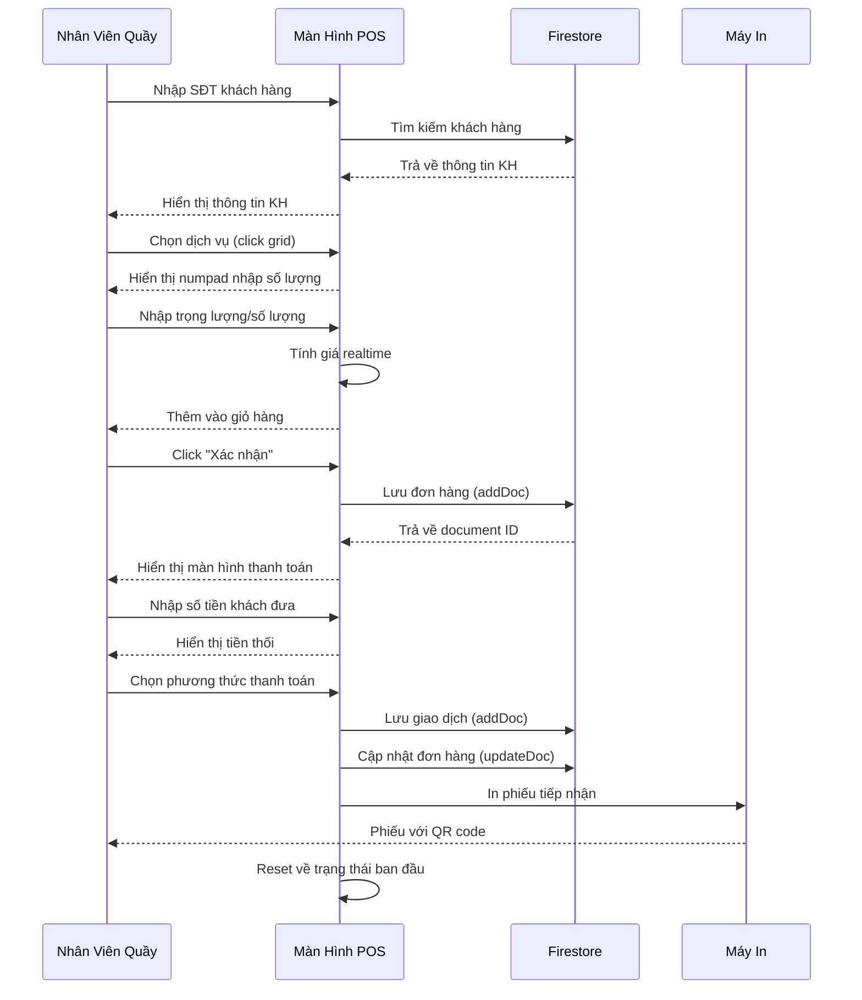
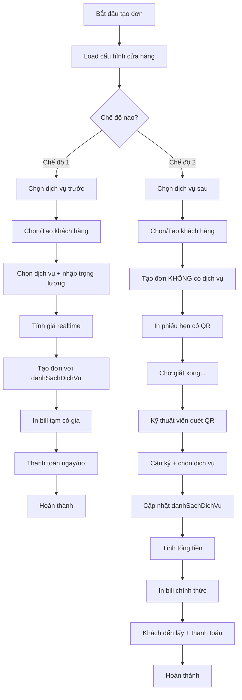

# Tài Liệu Thiết Kế: Hệ Thống Quản Lý Cửa Hàng Giặt Sấy

## Tổng Quan

Hệ thống quản lý cửa hàng giặt sấy là một ứng dụng toàn diện giúp chủ cửa hàng quản lý toàn bộ quy trình kinh doanh từ tiếp nhận đơn hàng, theo dõi tiến độ giặt sấy, quản lý khách hàng, nhân viên, đến thanh toán và báo cáo doanh thu. Hệ thống cung cấp giao diện thân thiện cho cả nhân viên quầy và quản lý, đồng thời cho phép khách hàng tra cứu tình trạng đơn hàng của mình.

Hệ thống được thiết kế theo kiến trúc phân lớp với các module độc lập, dễ bảo trì và mở rộng. Dữ liệu được lưu trữ tập trung trên Firebase Firestore, đảm bảo tính nhất quán và khả năng truy xuất nhanh chóng. Hệ thống hỗ trợ nhiều loại dịch vụ giặt sấy khác nhau, tính giá linh hoạt theo trọng lượng hoặc số lượng, và quản lý trạng thái đơn hàng theo thời gian thực.

**Công Nghệ Sử Dụng**:

- **Frontend**: React webapp (responsive cho cả PC và mobile)
- **Database**: Firebase Firestore (NoSQL document-based)
- **Authentication**: Firebase Authentication
- **Storage**: Firebase Storage (cho hình ảnh, file đính kèm)
- **Hosting & Deployment**: Vercel (free tier)
- **Cloud Functions**: Firebase Cloud Functions (nếu cần xử lý backend)

## Kiến Trúc Hệ Thống

```mermaid
graph TD
    A[React Web App] --> B[Firebase SDK]
    B --> C[Firebase Authentication]
    B --> D[Firebase Firestore]
    B --> E[Firebase Storage]
    B --> F[Firebase Cloud Functions]

    A --> G[React Components]
    G --> H[Order Management]
    G --> I[Customer Management]
    G --> J[Employee Management]
    G --> K[Payment Processing]
    G --> L[Reports & Analytics]

    H --> B
    I --> B
    J --> B
    K --> B
    L --> B

    M[Vercel CDN] --> A

    style A fill:#61dafb
    style D fill:#ffa611
    style M fill:#000000
```



**Kiến Trúc Chi Tiết**:

1. **Frontend Layer (React)**:
   - Single Page Application (SPA) với React
   - React Router cho navigation
   - Context API / Redux cho state management
   - Material-UI hoặc Ant Design cho UI components
   - Responsive design cho PC và mobile

2. **Backend Services (Firebase)**:
   - **Firestore**: NoSQL database cho dữ liệu chính
   - **Authentication**: Quản lý đăng nhập nhân viên
   - **Storage**: Lưu trữ hình ảnh đơn hàng, hóa đơn
   - **Cloud Functions**: Xử lý logic phức tạp, scheduled tasks

3. **Deployment (Vercel)**:
   - Automatic deployment từ Git
   - CDN global cho performance
   - Serverless functions (nếu cần)
   - HTTPS mặc định

````

## Sơ Đồ Luồng Xử Lý Chính

### Luồng Tiếp Nhận Đơn Hàng

```mermaid
sequenceDiagram
    participant KH as Khách Hàng
    participant NV as Nhân Viên
    participant React as React App
    participant FS as Firestore
    participant Auth as Firebase Auth

    KH->>NV: Mang quần áo đến
    NV->>React: Tạo đơn hàng mới
    React->>React: Tạo mã đơn hàng (client-side)
    NV->>React: Nhập thông tin (loại dịch vụ, trọng lượng)
    React->>React: Tính toán giá tiền
    React->>FS: Lưu đơn hàng (addDoc)
    FS-->>React: Xác nhận với document ID
    React-->>NV: Hiển thị thông tin đơn hàng
    NV->>KH: In phiếu tiếp nhận
    KH->>NV: Thanh toán (nếu trả trước)
    NV->>React: Ghi nhận thanh toán
    React->>FS: Cập nhật trạng thái thanh toán (updateDoc)
````

````

### Luồng Cập Nhật Trạng Thái Đơn Hàng

```mermaid
sequenceDiagram
    participant NV as Nhân Viên
    participant React as React App
    participant FS as Firestore
    participant KH as Khách Hàng

    NV->>React: Quét mã đơn hàng
    React->>FS: Truy vấn thông tin đơn (getDoc)
    FS-->>React: Trả về document snapshot
    React-->>NV: Hiển thị trạng thái hiện tại
    NV->>React: Cập nhật trạng thái mới
    React->>React: Kiểm tra tính hợp lệ
    React->>FS: Lưu trạng thái mới (updateDoc)
    React->>FS: Ghi log lịch sử (arrayUnion)
    React-->>KH: Gửi thông báo (nếu có - via Cloud Functions)
````

## Các Thành Phần và Giao Diện

### Thành Phần 0: Màn Hình POS (Point of Sale) - QUAN TRỌNG

**Mục đích**: Cung cấp giao diện tối ưu cho nhân viên quầy để tiếp nhận và xử lý đơn hàng nhanh chóng

**Thiết kế giao diện POS**:

```
┌─────────────────────────────────────────────────────────────────┐
│  LOGO    Màn Hình POS - Nhân Viên: [Tên]    [Đăng xuất]        │
├─────────────────────────────────────────────────────────────────┤
│                                                                  │
│  ┌──────────────────────────┐  ┌────────────────────────────┐  │
│  │  TÌM KHÁCH HÀNG          │  │  GIỎ HÀNG                  │  │
│  │  ┌────────────────────┐  │  │  ┌──────────────────────┐ │  │
│  │  │ 📱 0901234567      │  │  │  │ Giặt thường - 5kg    │ │  │
│  │  └────────────────────┘  │  │  │ 50,000 VNĐ      [X]  │ │  │
│  │                          │  │  ├──────────────────────┤ │  │
│  │  👤 Nguyễn Văn A         │  │  │ Ủi áo sơ mi - 2 cái │ │  │
│  │  ⭐ VIP - 1,250 điểm     │  │  │ 40,000 VNĐ      [X]  │ │  │
│  │  📞 0901234567           │  │  └──────────────────────┘ │  │
│  │  [Tạo KH mới]            │  │                            │  │
│  └──────────────────────────┘  │  TỔNG CỘNG: 90,000 VNĐ    │  │
│                                 │  Ngày hẹn trả: 25/02/2026  │  │
│  ┌──────────────────────────┐  │  [Xóa tất cả] [Xác nhận]  │  │
│  │  CHỌN DỊCH VỤ            │  └────────────────────────────┘  │
│  │  ┌────┐ ┌────┐ ┌────┐   │                                   │
│  │  │🧺  │ │👔  │ │🧼  │   │  ┌────────────────────────────┐  │
│  │  │Giặt│ │ Ủi │ │Giặt│   │  │  ĐƠN HÀNG GẦN ĐÂY          │  │
│  │  │Thường│ │   │ │Khô │   │  │  #DH20260225001 - 150k    │  │
│  │  │15k/kg│ │20k│ │30k/kg│  │  │  #DH20260225002 - 80k     │  │
│  │  └────┘ └────┘ └────┘   │  │  #DH20260225003 - 200k    │  │
│  │  ┌────┐ ┌────┐ ┌────┐   │  └────────────────────────────┘  │
│  │  │🌟  │ │🧴  │ │📦  │   │                                   │
│  │  │Giặt│ │Giặt│ │Gói │   │  ┌────────────────────────────┐  │
│  │  │Hấp │ │Thảm│ │Combo│  │  │  THỐNG KÊ HÔM NAY          │  │
│  │  │25k/kg│ │50k│ │...│   │  │  📊 Đơn hàng: 15           │  │
│  │  └────┘ └────┘ └────┘   │  │  💰 Doanh thu: 2,500,000đ  │  │
│  └──────────────────────────┘  └────────────────────────────┘  │
│                                                                  │
│  [F1: Tìm KH] [F2: Thêm DV] [F3: Thanh toán] [F4: Quét QR]    │
└─────────────────────────────────────────────────────────────────┘
```

**Luồng xử lý POS**:



**Component React cho POS**:

```typescript
interface POSScreenProps {
  nhanVien: NhanVien;
}

interface POSState {
  khachHang: KhachHang | null;
  gioHang: ChiTietDichVu[];
  tongTien: number;
  step: 'chon-dich-vu' | 'thanh-toan' | 'hoan-thanh';
}

const POSScreen: React.FC<POSScreenProps> = ({ nhanVien }) => {
  const [state, setState] = useState<POSState>({
    khachHang: null,
    gioHang: [],
    tongTien: 0,
    step: 'chon-dich-vu'
  });

  // Tìm khách hàng
  const timKhachHang = async (soDienThoai: string) => {
    const khachHang = await db.collection('khachHang')
      .where('soDienThoai', '==', soDienThoai)
      .limit(1)
      .get();
    // ...
  };

  // Thêm dịch vụ vào giỏ
  const themDichVu = (dichVu: DichVu, soLuong: number) => {
    const chiTiet = {
      maDichVu: dichVu.maDichVu,
      tenDichVu: dichVu.tenDichVu,
      soLuong,
      donGia: dichVu.giaTheoKg,
      thanhTien: soLuong * dichVu.giaTheoKg
    };
    setState(prev => ({
      ...prev,
      gioHang: [...prev.gioHang, chiTiet],
      tongTien: prev.tongTien + chiTiet.thanhTien
    }));
  };

  // Xác nhận tạo đơn hàng
  const xacNhanDonHang = async () => {
    const donHang = {
      maKhachHang: state.khachHang?.maKhachHang,
      maNhanVien: nhanVien.maNhanVien,
      danhSachDichVu: state.gioHang,
      tongTien: state.tongTien,
      trangThai: 'CHO_XU_LY',
      ngayTao: serverTimestamp()
    };
    await db.collection('donHang').add(donHang);
    setState(prev => ({ ...prev, step: 'thanh-toan' }));
  };

  return (
    <div className="pos-screen">
      <POSHeader nhanVien={nhanVien} />
      <div className="pos-body">
        <CustomerSearch onSelect={setKhachHang} />
        <ServiceGrid onSelect={themDichVu} />
        <Cart items={state.gioHang} total={state.tongTien} />
        <RecentOrders />
        <DailyStats />
      </div>
      <POSFooter shortcuts={KEYBOARD_SHORTCUTS} />
    </div>
  );
};
```

**Keyboard Shortcuts**:

- F1: Focus vào ô tìm khách hàng
- F2: Mở dialog chọn dịch vụ
- F3: Chuyển sang màn hình thanh toán
- F4: Mở camera quét QR code
- ESC: Hủy thao tác hiện tại
- Enter: Xác nhận

**Responsive Design**:

- Desktop (>1024px): Layout 3 cột như mockup
- Tablet (768-1024px): Layout 2 cột, sidebar thu gọn
- Mobile (<768px): Layout 1 cột, full screen cho từng bước

### Thành Phần 1: Quản Lý Đơn Hàng

**Mục đích**: Xử lý toàn bộ vòng đời của đơn hàng từ tạo mới đến hoàn thành

**Giao diện**:

```typescript
interface QuanLyDonHang {
  taoDonHang(
    thongTinKhachHang: ThongTinKhachHang,
    danhSachDichVu: DichVuYeuCau[],
  ): Promise<DonHang>;
  capNhatTrangThai(
    maDonHang: string,
    trangThaiMoi: TrangThaiDonHang,
  ): Promise<KetQua>;
  tinhTongTien(donHang: DonHang): number;
  timKiemDonHang(tieuChi: TieuChiTimKiem): Promise<DonHang[]>;
  huyDonHang(maDonHang: string, lyDo: string): Promise<KetQua>;
}
```

**Trách nhiệm**:

- Tạo và quản lý đơn hàng mới
- Cập nhật trạng thái đơn hàng theo quy trình
- Tính toán giá tiền dựa trên dịch vụ và trọng lượng
- Tìm kiếm và lọc đơn hàng theo nhiều tiêu chí
- Xử lý hủy đơn và hoàn tiền

### Thành Phần 2: Quản Lý Khách Hàng

**Mục đích**: Quản lý thông tin khách hàng và lịch sử giao dịch

**Giao diện**:

```typescript
interface QuanLyKhachHang {
  themKhachHang(thongTin: ThongTinKhachHang): Promise<KhachHang>;
  capNhatThongTin(
    maKhachHang: string,
    thongTinMoi: Partial<KhachHang>,
  ): Promise<KetQua>;
  timKhachHang(soDienThoai: string): Promise<KhachHang | null>;
  layLichSuGiaoDich(maKhachHang: string): Promise<DonHang[]>;
  tinhDiemTichLuy(maKhachHang: string): Promise<number>;
}
```

**Trách nhiệm**:

- Lưu trữ và cập nhật thông tin khách hàng
- Tra cứu khách hàng nhanh chóng qua số điện thoại
- Theo dõi lịch sử giao dịch của khách hàng
- Quản lý chương trình khách hàng thân thiết
- Tính toán điểm tích lũy và ưu đãi

### Thành Phần 3: Quản Lý Dịch Vụ

**Mục đích**: Quản lý các loại dịch vụ giặt sấy và bảng giá

**Giao diện**:

```typescript
interface QuanLyDichVu {
  themDichVu(
    tenDichVu: string,
    moTa: string,
    bangGia: BangGia,
  ): Promise<DichVu>;
  capNhatGia(
    maDichVu: string,
    giaTheoTrongLuong: number,
    giaTheoSoLuong: number,
  ): Promise<KetQua>;
  layDanhSachDichVu(): Promise<DichVu[]>;
  tinhGiaDichVu(maDichVu: string, trongLuong: number, soLuong: number): number;
}
```

**Trách nhiệm**:

- Quản lý danh mục dịch vụ (giặt thường, giặt khô, ủi, giặt hấp...)
- Cập nhật bảng giá linh hoạt
- Tính giá dựa trên trọng lượng hoặc số lượng
- Hỗ trợ nhiều phương thức tính giá

### Thành Phần 4: Quản Lý Thanh Toán

**Mục đích**: Xử lý các giao dịch thanh toán và theo dõi công nợ

**Giao diện**:

```typescript
interface QuanLyThanhToan {
  taoGiaoDich(
    maDonHang: string,
    soTien: number,
    phuongThuc: PhuongThucThanhToan,
  ): Promise<GiaoDich>;
  xacNhanThanhToan(maGiaoDich: string): Promise<KetQua>;
  hoanTien(maGiaoDich: string, soTien: number, lyDo: string): Promise<KetQua>;
  layLichSuThanhToan(maDonHang: string): Promise<GiaoDich[]>;
  tinhCongNo(maKhachHang: string): Promise<number>;
}
```

**Trách nhiệm**:

- Ghi nhận các giao dịch thanh toán
- Hỗ trợ nhiều phương thức thanh toán (tiền mặt, chuyển khoản, thẻ)
- Xử lý hoàn tiền khi hủy đơn
- Theo dõi công nợ khách hàng
- Tạo hóa đơn và biên lai

### Thành Phần 5: Quản Lý Nhân Viên

**Mục đích**: Quản lý thông tin nhân viên và phân quyền

**Giao diện**:

```pascal
INTERFACE QuanLyNhanVien
  PROCEDURE themNhanVien(thongTin, vaiTro): NhanVien
  PROCEDURE capNhatThongTin(maNhanVien, thongTinMoi): KetQua
  PROCEDURE phanQuyen(maNhanVien, danhSachQuyen): KetQua
  PROCEDURE kiemTraQuyen(maNhanVien, chucNang): Boolean
  PROCEDURE ghiNhanCaLam(maNhanVien, gioBatDau, gioKetThuc): KetQua
END INTERFACE
```

**Trách nhiệm**:

- Quản lý hồ sơ nhân viên
- Phân quyền truy cập theo vai trò
- Theo dõi ca làm việc
- Ghi nhận hoạt động của nhân viên

### Thành Phần 6: Báo Cáo và Thống Kê

**Mục đích**: Tạo các báo cáo kinh doanh và phân tích dữ liệu

**Giao diện**:

```pascal
INTERFACE BaoCaoThongKe
  PROCEDURE baoCaoDoanhThu(tuNgay, denNgay): BaoCao
  PROCEDURE baoCaoDonHang(tuNgay, denNgay, trangThai): BaoCao
  PROCEDURE thongKeKhachHang(loaiThongKe): BaoCao
  PROCEDURE thongKeDichVu(tuNgay, denNgay): BaoCao
  PROCEDURE xuatBaoCao(baoCao, dinhDang): File
END INTERFACE
```

**Trách nhiệm**:

- Tạo báo cáo doanh thu theo thời gian
- Thống kê đơn hàng theo trạng thái
- Phân tích xu hướng khách hàng
- Đánh giá hiệu quả dịch vụ
- Xuất báo cáo ra nhiều định dạng (PDF, Excel)

## Mô Hình Dữ Liệu

### Kiến Trúc Multi-Tenant

Hệ thống sử dụng kiến trúc multi-tenant với data isolation:

- Mỗi cửa hàng có `maCuaHang` duy nhất
- Tất cả collections có trường `maCuaHang` để phân biệt dữ liệu
- Firebase Security Rules enforce data isolation
- Composite indexes trên `(maCuaHang, ...)` để tối ưu query

### Mô Hình 0: CuaHang (Cửa Hàng)

```typescript
interface CuaHang {
  maCuaHang: string; // Primary key, định dạng: CH0001
  tenCuaHang: string; // Tên cửa hàng
  diaChi: string; // Địa chỉ
  soDienThoai: string; // SĐT liên hệ
  email: string; // Email
  trangThai: TrangThaiCuaHang; // HOAT_DONG, TAM_NGUNG, DONG_CUA
  ngayTao: Timestamp; // Ngày tạo
  maAdminChinh: string; // UID của admin chính
  thongTinThanhToan?: {
    // Thông tin thanh toán (optional)
    tenNganHang: string;
    soTaiKhoan: string;
    chuTaiKhoan: string;
  };
  cauHinh?: {
    // Cấu hình cửa hàng
    gioMoCua: string; // "08:00"
    gioDongCua: string; // "22:00"
    ngayNghiTrongTuan: number[]; // [0, 6] = Chủ nhật, Thứ 7
  };
}

enum TrangThaiCuaHang {
  HOAT_DONG = "HOAT_DONG",
  TAM_NGUNG = "TAM_NGUNG",
  DONG_CUA = "DONG_CUA",
}
```

**Quy tắc kiểm tra**:

- maCuaHang phải là duy nhất, định dạng CH + 4 chữ số
- tenCuaHang không được rỗng
- soDienThoai phải hợp lệ (10-11 số)
- email phải đúng định dạng
- maAdminChinh phải tồn tại trong collection users

**Firestore path**: `/cuaHang/{maCuaHang}`

### Mô Hình 0.1: CauHinhCuaHang (Cấu Hình Cửa Hàng)

```typescript
interface CauHinhCuaHang {
  maCuaHang: string; // Foreign key -> CuaHang
  cheDoTaoDonHang: CheDoTaoDonHang; // Chế độ tạo đơn hàng
  gioMoCua: string; // "08:00"
  gioDongCua: string; // "22:00"
  ngayNghiTrongTuan: number[]; // [0, 6] = Chủ nhật, Thứ 7
  thongTinThanhToan?: {
    tenNganHang: string;
    soTaiKhoan: string;
    chuTaiKhoan: string;
  };
  mauInPhieu?: {
    logoUrl?: string;
    thongTinLienHe: string;
    footer: string;
  };
  capNhatLanCuoi: Timestamp;
  nguoiCapNhat: string; // UID của admin
}

enum CheDoTaoDonHang {
  CHON_DICH_VU_TRUOC = "CHON_DICH_VU_TRUOC", // Mặc định
  CHON_DICH_VU_SAU = "CHON_DICH_VU_SAU", // Cân ký sau
}
```

**Quy tắc kiểm tra**:

- maCuaHang phải tồn tại trong collection cuaHang
- cheDoTaoDonHang mặc định là CHON_DICH_VU_TRUOC
- gioMoCua phải trước gioDongCua
- Chỉ ADMIN và SUPER_ADMIN mới được cập nhật

**Firestore path**: `/cauHinhCuaHang/{maCuaHang}`

**Security Rules**:

```javascript
match /cauHinhCuaHang/{maCuaHang} {
  allow read: if isSuperAdmin() || isSameCuaHang(maCuaHang);
  allow write: if isSuperAdmin() || (hasRole('ADMIN') && isSameCuaHang(maCuaHang));
}
```

### Mô Hình 1: DonHang (Đơn Hàng)

```typescript
interface DonHang {
  maDonHang: string; // Primary key, định dạng: DH + YYYYMMDD + 4 số
  maCuaHang: string; // Foreign key -> CuaHang (QUAN TRỌNG cho multi-tenant)
  maKhachHang: string; // Foreign key -> KhachHang
  maNhanVien: string; // Foreign key -> Users (người tạo đơn)
  ngayTao: Timestamp; // Server timestamp
  ngayHenTra: Timestamp; // Ngày hẹn trả
  trangThai: TrangThaiDonHang; // Trạng thái hiện tại
  danhSachDichVu: ChiTietDichVu[]; // Danh sách dịch vụ (có thể rỗng nếu chế độ 2)
  tongTrongLuong: number; // Tổng trọng lượng (kg)
  tongTien: number; // Tổng tiền (0 nếu chưa xác định dịch vụ)
  tienDaTra: number; // Tiền đã thanh toán
  tienConLai: number; // Tiền còn lại
  ghiChu?: string; // Ghi chú
  lichSuCapNhat: LichSuTrangThai[]; // Lịch sử thay đổi trạng thái
  cheDoTaoDonHang: CheDoTaoDonHang; // Chế độ tạo đơn hàng (để biết cách xử lý)
  daXacDinhDichVu: boolean; // true nếu đã chọn dịch vụ (cho chế độ 2)
}

enum TrangThaiDonHang {
  CHO_XU_LY = "CHO_XU_LY", // Mới tạo, chưa xử lý
  CHO_CAN_KY = "CHO_CAN_KY", // (Chế độ 2) Đã giặt xong, chờ cân ký
  DANG_GIAT = "DANG_GIAT",
  DANG_SAY = "DANG_SAY",
  DANG_UI = "DANG_UI",
  HOAN_THANH = "HOAN_THANH",
  DA_GIAO = "DA_GIAO",
  DA_HUY = "DA_HUY",
}

interface ChiTietDichVu {
  maDichVu: string;
  tenDichVu: string;
  soLuong: number;
  trongLuong: number;
  donGia: number;
  thanhTien: number;
  ghiChu?: string;
  nguoiCapNhat?: string; // UID (cho chế độ 2 - ai cân ký)
  thoiGianCapNhat?: Timestamp; // Khi nào cân ký (cho chế độ 2)
}
```

**Quy tắc kiểm tra**:

- maDonHang phải là duy nhất và không rỗng
- maCuaHang phải khớp với maCuaHang của người tạo (Security Rules enforce)
- ngayHenTra phải sau ngayTao
- **Chế độ 1 (CHON_DICH_VU_TRUOC)**:
  - danhSachDichVu phải có ít nhất 1 dịch vụ
  - tongTrongLuong phải lớn hơn 0
  - tongTien phải bằng tổng giá trị các dịch vụ
  - daXacDinhDichVu = true
- **Chế độ 2 (CHON_DICH_VU_SAU)**:
  - danhSachDichVu có thể rỗng khi tạo đơn
  - tongTien = 0 khi chưa xác định dịch vụ
  - daXacDinhDichVu = false khi tạo, = true sau khi cân ký
  - Sau khi cân ký: danhSachDichVu phải có ít nhất 1 dịch vụ
- tienDaTra không được vượt quá tongTien
- tienConLai = tongTien - tienDaTra
- Chuyển trạng thái phải tuân theo quy trình

**Firestore path**: `/donHang/{maDonHang}`

**Indexes cần thiết**:

- Composite: `(maCuaHang, trangThai, ngayTao DESC)`
- Composite: `(maCuaHang, maKhachHang, ngayTao DESC)`
- Composite: `(maCuaHang, maNhanVien, ngayTao DESC)`
- Composite: `(maCuaHang, daXacDinhDichVu, ngayTao DESC)` - Để query đơn chưa cân ký
  HOAN_THANH = "HOAN_THANH",
  DA_GIAO = "DA_GIAO",
  DA_HUY = "DA_HUY",
  }

interface LichSuTrangThai {
trangThaiCu: TrangThaiDonHang;
trangThaiMoi: TrangThaiDonHang;
nguoiCapNhat: string; // UID của nhân viên
thoiGian: Timestamp;
}

```

**Quy tắc kiểm tra**:

- maDonHang phải là duy nhất và không rỗng
- maCuaHang phải khớp với maCuaHang của người tạo (Security Rules enforce)
- ngayHenTra phải sau ngayTao
- tongTrongLuong phải lớn hơn 0
- tongTien phải bằng tổng giá trị các dịch vụ
- tienDaTra không được vượt quá tongTien
- tienConLai = tongTien - tienDaTra
- Chuyển trạng thái phải tuân theo quy trình

**Firestore path**: `/donHang/{maDonHang}`

**Indexes cần thiết**:

- Composite: `(maCuaHang, trangThai, ngayTao DESC)`
- Composite: `(maCuaHang, maKhachHang, ngayTao DESC)`
- Composite: `(maCuaHang, maNhanVien, ngayTao DESC)`

### Mô Hình 2: KhachHang (Khách Hàng)

tongTien: Float
tienDaTra: Float
tienConLai: Float
ghiChu: String
lichSuCapNhat: Array OF LichSuTrangThai
END STRUCTURE

ENUMERATION TrangThaiDonHang
CHO_XU_LY
DANG_GIAT
DANG_SAY
DANG_UI
HOAN_THANH
DA_GIAO
DA_HUY
END ENUMERATION

```

**Quy tắc kiểm tra**:

- maDonHang phải là duy nhất và không rỗng
- ngayHenTra phải sau ngayTao
- tongTrongLuong phải lớn hơn 0
- tongTien phải bằng tổng giá trị các dịch vụ
- tienDaTra không được vượt quá tongTien
- tienConLai = tongTien - tienDaTra
- Chuyển trạng thái phải tuân theo quy trình

### Mô Hình 2: KhachHang (Khách Hàng)

```pascal
STRUCTURE KhachHang
  maKhachHang: String
  hoTen: String
  soDienThoai: String
  email: String
  diaChi: String
  ngayDangKy: DateTime
  loaiKhachHang: LoaiKhachHang
  diemTichLuy: Integer
  tongChiTieu: Float
  soLanGiaoDich: Integer
END STRUCTURE

ENUMERATION LoaiKhachHang
  THUONG
  THAN_THIET
  VIP
END ENUMERATION
```

**Quy tắc kiểm tra**:

- maKhachHang phải là duy nhất
- soDienThoai phải hợp lệ và duy nhất (10-11 số)
- email phải đúng định dạng (nếu có)
- diemTichLuy không được âm
- tongChiTieu phải khớp với tổng giá trị đơn hàng
- loaiKhachHang tự động nâng cấp dựa trên tongChiTieu

### Mô Hình 3: DichVu (Dịch Vụ)

```pascal
STRUCTURE DichVu
  maDichVu: String
  tenDichVu: String
  moTa: String
  loaiTinhGia: LoaiTinhGia
  giaTheoKg: Float
  giaTheoSoLuong: Float
  thoiGianXuLy: Integer
  trangThai: Boolean
END STRUCTURE

ENUMERATION LoaiTinhGia
  THEO_TRONG_LUONG
  THEO_SO_LUONG
  CO_DINH
END ENUMERATION

STRUCTURE ChiTietDichVu
  maDichVu: String
  tenDichVu: String
  soLuong: Integer
  trongLuong: Float
  donGia: Float
  thanhTien: Float
  ghiChu: String
END STRUCTURE
```

**Quy tắc kiểm tra**:

- maDichVu phải là duy nhất
- tenDichVu không được rỗng
- giaTheoKg và giaTheoSoLuong phải lớn hơn 0
- thoiGianXuLy tính bằng phút, phải lớn hơn 0
- thanhTien = donGia × (soLuong hoặc trongLuong)

### Mô Hình 4: GiaoDich (Giao Dịch Thanh Toán)

```pascal
STRUCTURE GiaoDich
  maGiaoDich: String
  maDonHang: String
  maKhachHang: String
  maNhanVien: String
  ngayGiaoDich: DateTime
  soTien: Float
  phuongThucThanhToan: PhuongThucThanhToan
  trangThai: TrangThaiGiaoDich
  ghiChu: String
END STRUCTURE

ENUMERATION PhuongThucThanhToan
  TIEN_MAT
  CHUYEN_KHOAN
  THE_ATM
  VI_DIEN_TU
END ENUMERATION

ENUMERATION TrangThaiGiaoDich
  CHO_XAC_NHAN
  THANH_CONG
  THAT_BAI
  DA_HOAN
END ENUMERATION
```

**Quy tắc kiểm tra**:

- maGiaoDich phải là duy nhất
- soTien phải lớn hơn 0
- Giao dịch hoàn tiền có soTien âm
- Tổng các giao dịch của một đơn hàng không vượt quá tongTien

### Mô Hình 6: Users (Người Dùng - Bao gồm tất cả cấp)

```typescript
interface User {
  uid: string; // Firebase Auth UID (Primary key)
  maCuaHang: string | null; // Foreign key -> CuaHang (null nếu SUPER_ADMIN)
  hoTen: string; // Họ tên
  soDienThoai: string; // Số điện thoại
  email: string; // Email
  vaiTro: VaiTro; // Vai trò trong hệ thống
  trangThai: TrangThaiNhanVien; // Trạng thái
  ngayVaoLam: Timestamp; // Ngày bắt đầu làm việc
  danhSachQuyen?: string[]; // Quyền bổ sung (optional)
  createdBy?: string; // UID người tạo
}

enum VaiTro {
  SUPER_ADMIN = "SUPER_ADMIN", // Quản trị toàn hệ thống
  ADMIN = "ADMIN", // Quản lý cửa hàng
  NHAN_VIEN_QUAY = "NHAN_VIEN_QUAY",
  KY_THUAT_VIEN = "KY_THUAT_VIEN",
}

enum TrangThaiNhanVien {
  DANG_LAM_VIEC = "DANG_LAM_VIEC",
  NGHI_PHEP = "NGHI_PHEP",
  DA_NGHI_VIEC = "DA_NGHI_VIEC",
}
```

**Quy tắc kiểm tra**:

- uid phải là duy nhất (Firebase Auth UID)
- SUPER_ADMIN: maCuaHang = null
- ADMIN, NHAN_VIEN_QUAY, KY_THUAT_VIEN: maCuaHang không được null
- soDienThoai phải hợp lệ (10-11 số)
- email phải đúng định dạng
- Chỉ SUPER_ADMIN mới có thể tạo ADMIN
- Chỉ SUPER_ADMIN và ADMIN mới có thể tạo NHAN_VIEN_QUAY, KY_THUAT_VIEN

**Firestore path**: `/users/{uid}`

**Custom Claims** (lưu trong Firebase Auth token):

```typescript
interface CustomClaims {
  vaiTro: VaiTro;
  maCuaHang: string | null;
}
```

**Indexes cần thiết**:

- Composite: `(maCuaHang, vaiTro, trangThai)`
- Single: `vaiTro` (cho SUPER_ADMIN query tất cả)

## Thuật Toán Pseudocode

### Luồng Xử Lý 2 Chế Độ Tạo Đơn Hàng



### Thuật Toán: Tạo Đơn Hàng Theo Chế Độ

```typescript
async function taoDonHangTheoCheDo(
  thongTinKhachHang: ThongTinKhachHang,
  danhSachDichVu: DichVuYeuCau[] | null, // null nếu chế độ 2
  currentUser: User,
): Promise<DonHang | Error> {
  // Lấy cấu hình cửa hàng
  const cauHinh = await db
    .collection("cauHinhCuaHang")
    .doc(currentUser.maCuaHang)
    .get();

  const cheDoTaoDonHang =
    cauHinh.data()?.cheDoTaoDonHang || "CHON_DICH_VU_TRUOC";

  // Validate theo chế độ
  if (cheDoTaoDonHang === "CHON_DICH_VU_TRUOC") {
    if (!danhSachDichVu || danhSachDichVu.length === 0) {
      throw new Error(
        "Chế độ 'Chọn dịch vụ trước' yêu cầu phải chọn ít nhất 1 dịch vụ",
      );
    }
  }

  // Tìm hoặc tạo khách hàng
  const khachHang = await timHoacTaoKhachHang(
    thongTinKhachHang,
    currentUser.maCuaHang,
  );

  // Tạo mã đơn hàng
  const maDonHang = taoMaDonHang();

  let tongTien = 0;
  let tongTrongLuong = 0;
  let chiTietDonHang: ChiTietDichVu[] = [];
  let daXacDinhDichVu = false;

  // Xử lý theo chế độ
  if (cheDoTaoDonHang === "CHON_DICH_VU_TRUOC" && danhSachDichVu) {
    // Chế độ 1: Tính giá ngay
    for (const dichVu of danhSachDichVu) {
      const thanhTien = await tinhGiaDichVu(dichVu, currentUser.maCuaHang);
      chiTietDonHang.push({
        ...dichVu,
        thanhTien,
      });
      tongTien += thanhTien;
      tongTrongLuong += dichVu.trongLuong || 0;
    }
    daXacDinhDichVu = true;
  } else {
    // Chế độ 2: Để trống, sẽ cập nhật sau
    chiTietDonHang = [];
    tongTien = 0;
    tongTrongLuong = 0;
    daXacDinhDichVu = false;
  }

  // Tạo đơn hàng
  const donHang: DonHang = {
    maDonHang,
    maCuaHang: currentUser.maCuaHang,
    maKhachHang: khachHang.maKhachHang,
    maNhanVien: currentUser.uid,
    ngayTao: FieldValue.serverTimestamp(),
    ngayHenTra: tinhNgayHenTra(cheDoTaoDonHang, danhSachDichVu),
    trangThai: TrangThaiDonHang.CHO_XU_LY,
    danhSachDichVu: chiTietDonHang,
    tongTrongLuong,
    tongTien,
    tienDaTra: 0,
    tienConLai: tongTien,
    cheDoTaoDonHang,
    daXacDinhDichVu,
    lichSuCapNhat: [],
  };

  // Lưu vào Firestore
  await db.collection("donHang").doc(maDonHang).set(donHang);

  // Ghi audit log
  await ghiAuditLog({
    action: "CREATE_ORDER",
    userId: currentUser.uid,
    maCuaHang: currentUser.maCuaHang,
    data: { maDonHang, cheDoTaoDonHang, daXacDinhDichVu },
  });

  return donHang;
}
```

### Thuật Toán: Cập Nhật Dịch Vụ Sau Khi Cân Ký (Chế Độ 2)

```typescript
async function capNhatDichVuSauCanKy(
  maDonHang: string,
  danhSachDichVu: DichVuYeuCau[],
  currentUser: User,
): Promise<DonHang | Error> {
  // Lấy đơn hàng
  const donHangRef = db.collection("donHang").doc(maDonHang);
  const donHangSnap = await donHangRef.get();

  if (!donHangSnap.exists) {
    throw new Error("Không tìm thấy đơn hàng");
  }

  const donHang = donHangSnap.data() as DonHang;

  // Kiểm tra quyền truy cập
  if (!kiemTraQuyenTruyCap(currentUser, donHang.maCuaHang, "UPDATE_ORDER")) {
    throw new Error("Không có quyền cập nhật đơn hàng này");
  }

  // Kiểm tra chế độ
  if (donHang.cheDoTaoDonHang !== "CHON_DICH_VU_SAU") {
    throw new Error("Đơn hàng này không phải chế độ 'Chọn dịch vụ sau'");
  }

  // Kiểm tra đã cập nhật chưa
  if (donHang.daXacDinhDichVu) {
    throw new Error("Đơn hàng này đã được cập nhật dịch vụ rồi");
  }

  // Validate danh sách dịch vụ
  if (!danhSachDichVu || danhSachDichVu.length === 0) {
    throw new Error("Phải chọn ít nhất 1 dịch vụ");
  }

  // Tính giá
  let tongTien = 0;
  let tongTrongLuong = 0;
  const chiTietDonHang: ChiTietDichVu[] = [];

  for (const dichVu of danhSachDichVu) {
    const thanhTien = await tinhGiaDichVu(dichVu, donHang.maCuaHang);
    chiTietDonHang.push({
      ...dichVu,
      thanhTien,
      nguoiCapNhat: currentUser.uid,
      thoiGianCapNhat: FieldValue.serverTimestamp(),
    });
    tongTien += thanhTien;
    tongTrongLuong += dichVu.trongLuong || 0;
  }

  // Cập nhật đơn hàng
  await donHangRef.update({
    danhSachDichVu: chiTietDonHang,
    tongTrongLuong,
    tongTien,
    tienConLai: tongTien, // Chưa thanh toán
    daXacDinhDichVu: true,
    trangThai: TrangThaiDonHang.HOAN_THANH,
    lichSuCapNhat: FieldValue.arrayUnion({
      trangThaiCu: donHang.trangThai,
      trangThaiMoi: TrangThaiDonHang.HOAN_THANH,
      nguoiCapNhat: currentUser.uid,
      thoiGian: FieldValue.serverTimestamp(),
      ghiChu: "Đã cân ký và xác định dịch vụ",
    }),
  });

  // Ghi audit log
  await ghiAuditLog({
    action: "UPDATE_SERVICE_AFTER_WEIGHING",
    userId: currentUser.uid,
    maCuaHang: donHang.maCuaHang,
    data: { maDonHang, tongTien, soLuongDichVu: chiTietDonHang.length },
  });

  return {
    ...donHang,
    danhSachDichVu: chiTietDonHang,
    tongTien,
    daXacDinhDichVu: true,
  };
}
```

### Thuật Toán Chính: Xử Lý Tạo Đơn Hàng (với Multi-Tenant)

```typescript
async function xuLyTaoDonHang(
  thongTinKhachHang: ThongTinKhachHang,
  danhSachDichVu: DichVuYeuCau[],
  currentUser: User,
): Promise<DonHang | Error> {
  // Validate đầu vào
  if (danhSachDichVu.length === 0) {
    throw new Error("Danh sách dịch vụ không được rỗng");
  }

  if (!isValidPhone(thongTinKhachHang.soDienThoai)) {
    throw new Error("Số điện thoại không hợp lệ");
  }

  // Lấy maCuaHang từ currentUser
  const maCuaHang = currentUser.maCuaHang;
  if (!maCuaHang) {
    throw new Error("Người dùng không thuộc cửa hàng nào");
  }

  // Bước 1: Tìm hoặc tạo khách hàng (trong cùng cửa hàng)
  let khachHang = await db
    .collection("khachHang")
    .where("maCuaHang", "==", maCuaHang)
    .where("soDienThoai", "==", thongTinKhachHang.soDienThoai)
    .limit(1)
    .get();

  if (khachHang.empty) {
    khachHang = await taoKhachHangMoi({
      ...thongTinKhachHang,
      maCuaHang,
    });
  }

  // Bước 2: Tạo mã đơn hàng duy nhất
  const maDonHang = taoMaDonHang();

  // Bước 3: Tính toán giá tiền
  let tongTien = 0;
  let tongTrongLuong = 0;
  const chiTietDonHang: ChiTietDichVu[] = [];

  for (const dichVu of danhSachDichVu) {
    const thanhTien = await tinhGiaDichVu(dichVu, maCuaHang);
    chiTietDonHang.push({
      ...dichVu,
      thanhTien,
    });
    tongTien += thanhTien;
    tongTrongLuong += dichVu.trongLuong || 0;
  }

  // Bước 4: Tính ngày hẹn trả
  const thoiGianXuLy = tinhThoiGianXuLy(danhSachDichVu);
  const ngayHenTra = new Date(Date.now() + thoiGianXuLy * 60000);

  // Bước 5: Tạo đơn hàng
  const donHang: DonHang = {
    maDonHang,
    maCuaHang, // QUAN TRỌNG: Gán maCuaHang
    maKhachHang: khachHang.maKhachHang,
    maNhanVien: currentUser.uid,
    ngayTao: FieldValue.serverTimestamp(),
    ngayHenTra,
    trangThai: TrangThaiDonHang.CHO_XU_LY,
    danhSachDichVu: chiTietDonHang,
    tongTrongLuong,
    tongTien,
    tienDaTra: 0,
    tienConLai: tongTien,
    lichSuCapNhat: [],
  };

  // Bước 6: Lưu vào Firestore
  await db.collection("donHang").doc(maDonHang).set(donHang);

  // Bước 7: Ghi audit log
  await ghiAuditLog({
    action: "CREATE_ORDER",
    userId: currentUser.uid,
    maCuaHang,
    data: { maDonHang },
  });

  return donHang;
}
```

**Điều kiện tiên quyết**:

- danhSachDichVu không rỗng và chứa ít nhất một dịch vụ hợp lệ
- thongTinKhachHang.soDienThoai phải là số điện thoại hợp lệ (10-11 chữ số)
- currentUser phải có maCuaHang (không phải SUPER_ADMIN)
- Tất cả dịch vụ trong danhSachDichVu phải tồn tại và thuộc cùng maCuaHang

**Điều kiện hậu tố**:

- Trả về đơn hàng mới với maDonHang duy nhất
- donHang.maCuaHang khớp với currentUser.maCuaHang
- donHang.tongTien bằng tổng thanhTien của tất cả dịch vụ
- donHang.tienConLai bằng tongTien (chưa thanh toán)
- donHang.trangThai là CHO_XU_LY
- Đơn hàng đã được lưu vào Firestore
- Audit log đã được ghi nhận

### Thuật Toán: Kiểm Tra Quyền Truy Cập (Multi-Tenant)

```typescript
function kiemTraQuyenTruyCap(
  currentUser: User,
  targetMaCuaHang: string,
  action: string,
): boolean {
  // SUPER_ADMIN có quyền truy cập tất cả
  if (currentUser.vaiTro === VaiTro.SUPER_ADMIN) {
    return true;
  }

  // Kiểm tra maCuaHang khớp
  if (currentUser.maCuaHang !== targetMaCuaHang) {
    return false;
  }

  // Kiểm tra quyền theo vai trò
  const permissions = PERMISSIONS[currentUser.vaiTro];
  return permissions.includes(action);
}
```

## Thuật Toán Pseudocode (Legacy - Giữ lại để tham khảo)

### Thuật Toán Chính: Xử Lý Tạo Đơn Hàng (Phiên bản cũ)

```pascal
ALGORITHM xuLyTaoDonHang(thongTinKhachHang, danhSachDichVu)
INPUT: thongTinKhachHang (thông tin khách hàng), danhSachDichVu (danh sách dịch vụ)
OUTPUT: donHang (đơn hàng mới) hoặc lỗi

BEGIN
  ASSERT danhSachDichVu IS NOT EMPTY
  ASSERT thongTinKhachHang.soDienThoai IS VALID

  // Bước 1: Tìm hoặc tạo khách hàng
  khachHang ← timKhachHang(thongTinKhachHang.soDienThoai)

  IF khachHang IS NULL THEN
    khachHang ← taoKhachHangMoi(thongTinKhachHang)
    IF khachHang IS NULL THEN
      RETURN Error("Không thể tạo khách hàng")
    END IF
  END IF

  // Bước 2: Tạo mã đơn hàng duy nhất
  maDonHang ← taoMaDonHang()

  // Bước 3: Tính toán giá tiền với bất biến vòng lặp
  tongTien ← 0
  tongTrongLuong ← 0
  chiTietDonHang ← EMPTY_ARRAY

  FOR EACH dichVu IN danhSachDichVu DO
    ASSERT tongTien >= 0 AND tongTrongLuong >= 0

    chiTiet ← taoChiTietDichVu(dichVu)
    thanhTien ← tinhGiaDichVu(dichVu)

    chiTiet.thanhTien ← thanhTien
    tongTien ← tongTien + thanhTien
    tongTrongLuong ← tongTrongLuong + dichVu.trongLuong

    chiTietDonHang.ADD(chiTiet)
  END FOR

  // Bước 4: Tính ngày hẹn trả
  thoiGianXuLy ← tinhThoiGianXuLy(danhSachDichVu)
  ngayHenTra ← CURRENT_DATE + thoiGianXuLy

  // Bước 5: Tạo đơn hàng
  donHang ← NEW DonHang
  donHang.maDonHang ← maDonHang
  donHang.maKhachHang ← khachHang.maKhachHang
  donHang.maNhanVien ← CURRENT_USER.maNhanVien
  donHang.ngayTao ← CURRENT_DATETIME
  donHang.ngayHenTra ← ngayHenTra
  donHang.trangThai ← CHO_XU_LY
  donHang.danhSachDichVu ← chiTietDonHang
  donHang.tongTrongLuong ← tongTrongLuong
  donHang.tongTien ← tongTien
  donHang.tienDaTra ← 0
  donHang.tienConLai ← tongTien

  // Bước 6: Lưu vào cơ sở dữ liệu
  ketQua ← database.luuDonHang(donHang)

  IF ketQua IS SUCCESS THEN
    ghiLog("Tạo đơn hàng", maDonHang)
    ASSERT donHang.tongTien = tongTien
    ASSERT donHang.tienConLai = tongTien
    RETURN donHang
  ELSE
    RETURN Error("Không thể lưu đơn hàng")
  END IF
END
```

**Điều kiện tiên quyết**:

- danhSachDichVu không rỗng và chứa ít nhất một dịch vụ hợp lệ
- thongTinKhachHang.soDienThoai phải là số điện thoại hợp lệ (10-11 chữ số)
- Tất cả dịch vụ trong danhSachDichVu phải tồn tại trong hệ thống
- Người dùng hiện tại (CURRENT_USER) phải có quyền tạo đơn hàng

**Điều kiện hậu tố**:

- Trả về đơn hàng mới với maDonHang duy nhất
- donHang.tongTien bằng tổng thanhTien của tất cả dịch vụ
- donHang.tienConLai bằng tongTien (chưa thanh toán)
- donHang.trangThai là CHO_XU_LY
- Đơn hàng đã được lưu vào cơ sở dữ liệu
- Log đã được ghi nhận

**Bất biến vòng lặp**:

- Trong vòng lặp tính toán: tongTien và tongTrongLuong luôn không âm
- Mỗi chiTiet được thêm vào chiTietDonHang đều có thanhTien hợp lệ

### Thuật Toán: Cập Nhật Trạng Thái Đơn Hàng

```pascal
ALGORITHM capNhatTrangThaiDonHang(maDonHang, trangThaiMoi)
INPUT: maDonHang (mã đơn hàng), trangThaiMoi (trạng thái mới)
OUTPUT: ketQua (thành công hoặc lỗi)

BEGIN
  // Kiểm tra đầu vào
  IF maDonHang IS EMPTY THEN
    RETURN Error("Mã đơn hàng không hợp lệ")
  END IF

  // Bước 1: Lấy thông tin đơn hàng
  donHang ← database.layDonHang(maDonHang)

  IF donHang IS NULL THEN
    RETURN Error("Không tìm thấy đơn hàng")
  END IF

  // Bước 2: Kiểm tra quyền chuyển trạng thái
  IF NOT kiemTraQuyenCapNhat(CURRENT_USER, donHang) THEN
    RETURN Error("Không có quyền cập nhật")
  END IF

  // Bước 3: Kiểm tra tính hợp lệ của chuyển trạng thái
  IF NOT kiemTraChuyenTrangThaiHopLe(donHang.trangThai, trangThaiMoi) THEN
    RETURN Error("Không thể chuyển từ " + donHang.trangThai + " sang " + trangThaiMoi)
  END IF

  // Bước 4: Lưu trạng thái cũ
  trangThaiCu ← donHang.trangThai

  // Bước 5: Cập nhật trạng thái
  donHang.trangThai ← trangThaiMoi

  // Bước 6: Ghi lịch sử
  lichSu ← NEW LichSuTrangThai
  lichSu.trangThaiCu ← trangThaiCu
  lichSu.trangThaiMoi ← trangThaiMoi
  lichSu.nguoiCapNhat ← CURRENT_USER.maNhanVien
  lichSu.thoiGian ← CURRENT_DATETIME

  donHang.lichSuCapNhat.ADD(lichSu)

  // Bước 7: Lưu vào cơ sở dữ liệu
  ketQua ← database.capNhatDonHang(donHang)

  IF ketQua IS SUCCESS THEN
    // Bước 8: Gửi thông báo cho khách hàng (nếu cần)
    IF trangThaiMoi = HOAN_THANH OR trangThaiMoi = DA_GIAO THEN
      guiThongBaoKhachHang(donHang.maKhachHang, trangThaiMoi)
    END IF

    ghiLog("Cập nhật trạng thái", maDonHang, trangThaiCu, trangThaiMoi)
    RETURN Success("Cập nhật thành công")
  ELSE
    RETURN Error("Không thể cập nhật đơn hàng")
  END IF
END
```

**Điều kiện tiên quyết**:

- maDonHang không rỗng và tồn tại trong hệ thống
- trangThaiMoi là một giá trị hợp lệ trong TrangThaiDonHang
- CURRENT_USER có quyền cập nhật trạng thái đơn hàng
- Chuyển trạng thái phải tuân theo quy trình cho phép

**Điều kiện hậu tố**:

- Nếu thành công: donHang.trangThai = trangThaiMoi
- Lịch sử chuyển trạng thái được ghi nhận trong lichSuCapNhat
- Thông báo được gửi cho khách hàng nếu đơn hàng hoàn thành
- Log hệ thống được ghi nhận
- Nếu thất bại: trạng thái đơn hàng không thay đổi

**Bất biến vòng lặp**: Không áp dụng (không có vòng lặp)

### Thuật Toán: Tính Giá Dịch Vụ

```pascal
ALGORITHM tinhGiaDichVu(maDichVu, trongLuong, soLuong)
INPUT: maDichVu (mã dịch vụ), trongLuong (kg), soLuong (số lượng)
OUTPUT: giaTien (số tiền) hoặc lỗi

BEGIN
  ASSERT trongLuong >= 0 AND soLuong >= 0

  // Bước 1: Lấy thông tin dịch vụ
  dichVu ← database.layDichVu(maDichVu)

  IF dichVu IS NULL THEN
    RETURN Error("Dịch vụ không tồn tại")
  END IF

  IF dichVu.trangThai = FALSE THEN
    RETURN Error("Dịch vụ không còn hoạt động")
  END IF

  // Bước 2: Tính giá theo loại
  giaTien ← 0

  IF dichVu.loaiTinhGia = THEO_TRONG_LUONG THEN
    IF trongLuong <= 0 THEN
      RETURN Error("Trọng lượng phải lớn hơn 0")
    END IF
    giaTien ← trongLuong * dichVu.giaTheoKg

  ELSE IF dichVu.loaiTinhGia = THEO_SO_LUONG THEN
    IF soLuong <= 0 THEN
      RETURN Error("Số lượng phải lớn hơn 0")
    END IF
    giaTien ← soLuong * dichVu.giaTheoSoLuong

  ELSE IF dichVu.loaiTinhGia = CO_DINH THEN
    giaTien ← dichVu.giaTheoKg

  ELSE
    RETURN Error("Loại tính giá không hợp lệ")
  END IF

  // Bước 3: Làm tròn giá tiền
  giaTien ← ROUND(giaTien, 0)

  ASSERT giaTien >= 0
  RETURN giaTien
END
```

**Điều kiện tiên quyết**:

- maDichVu không rỗng
- trongLuong >= 0
- soLuong >= 0
- Dịch vụ tồn tại trong hệ thống

**Điều kiện hậu tố**:

- Trả về giá tiền >= 0
- Giá tiền được làm tròn đến đơn vị nguyên
- Nếu dịch vụ không hoạt động, trả về lỗi

**Bất biến vòng lặp**: Không áp dụng (không có vòng lặp)

### Thuật Toán: Xử Lý Thanh Toán

```pascal
ALGORITHM xuLyThanhToan(maDonHang, soTien, phuongThuc)
INPUT: maDonHang (mã đơn hàng), soTien (số tiền thanh toán), phuongThuc (phương thức)
OUTPUT: giaoDich (giao dịch mới) hoặc lỗi

BEGIN
  ASSERT soTien > 0

  // Bước 1: Lấy thông tin đơn hàng
  donHang ← database.layDonHang(maDonHang)

  IF donHang IS NULL THEN
    RETURN Error("Không tìm thấy đơn hàng")
  END IF

  // Bước 2: Kiểm tra số tiền
  IF soTien > donHang.tienConLai THEN
    RETURN Error("Số tiền thanh toán vượt quá số tiền còn lại")
  END IF

  // Bước 3: Tạo giao dịch
  maGiaoDich ← taoMaGiaoDich()

  giaoDich ← NEW GiaoDich
  giaoDich.maGiaoDich ← maGiaoDich
  giaoDich.maDonHang ← maDonHang
  giaoDich.maKhachHang ← donHang.maKhachHang
  giaoDich.maNhanVien ← CURRENT_USER.maNhanVien
  giaoDich.ngayGiaoDich ← CURRENT_DATETIME
  giaoDich.soTien ← soTien
  giaoDich.phuongThucThanhToan ← phuongThuc
  giaoDich.trangThai ← THANH_CONG

  // Bước 4: Cập nhật đơn hàng
  donHang.tienDaTra ← donHang.tienDaTra + soTien
  donHang.tienConLai ← donHang.tongTien - donHang.tienDaTra

  // Bước 5: Lưu giao dịch và cập nhật đơn hàng
  BEGIN TRANSACTION
    ketQua1 ← database.luuGiaoDich(giaoDich)
    ketQua2 ← database.capNhatDonHang(donHang)

    IF ketQua1 IS SUCCESS AND ketQua2 IS SUCCESS THEN
      COMMIT TRANSACTION

      // Bước 6: Cập nhật điểm tích lũy
      IF donHang.tienConLai = 0 THEN
        capNhatDiemTichLuy(donHang.maKhachHang, donHang.tongTien)
      END IF

      ghiLog("Thanh toán", maDonHang, soTien)
      ASSERT donHang.tienDaTra <= donHang.tongTien
      RETURN giaoDich
    ELSE
      ROLLBACK TRANSACTION
      RETURN Error("Không thể xử lý thanh toán")
    END IF
  END TRANSACTION
END
```

**Điều kiện tiên quyết**:

- maDonHang tồn tại trong hệ thống
- soTien > 0
- soTien <= donHang.tienConLai
- phuongThuc là phương thức thanh toán hợp lệ

**Điều kiện hậu tố**:

- Giao dịch mới được tạo và lưu vào cơ sở dữ liệu
- donHang.tienDaTra tăng thêm soTien
- donHang.tienConLai giảm đi soTien
- donHang.tienDaTra + donHang.tienConLai = donHang.tongTien
- Nếu thanh toán đủ, điểm tích lũy được cập nhật
- Transaction đảm bảo tính nhất quán dữ liệu

**Bất biến vòng lặp**: Không áp dụng (không có vòng lặp)

## Các Hàm Chính với Đặc Tả Hình Thức

### Hàm 1: taoMaDonHang()

```pascal
FUNCTION taoMaDonHang(): String
```

**Điều kiện tiên quyết**:

- Hệ thống có thể truy cập cơ sở dữ liệu
- Hệ thống có thể lấy thời gian hiện tại

**Điều kiện hậu tố**:

- Trả về chuỗi mã đơn hàng duy nhất
- Mã có định dạng: "DH" + YYYYMMDD + số thứ tự 4 chữ số
- Ví dụ: "DH202401150001"
- Mã không trùng với bất kỳ đơn hàng nào trong hệ thống

**Bất biến vòng lặp**: Không áp dụng

### Hàm 2: kiemTraChuyenTrangThaiHopLe()

```pascal
FUNCTION kiemTraChuyenTrangThaiHopLe(trangThaiHienTai, trangThaiMoi): Boolean
```

**Điều kiện tiên quyết**:

- trangThaiHienTai và trangThaiMoi là các giá trị hợp lệ trong TrangThaiDonHang

**Điều kiện hậu tố**:

- Trả về true nếu chuyển trạng thái hợp lệ theo quy trình
- Trả về false nếu chuyển trạng thái không được phép
- Quy trình hợp lệ:
  - CHO_XU_LY → DANG_GIAT
  - DANG_GIAT → DANG_SAY
  - DANG_SAY → DANG_UI (tùy chọn)
  - DANG_SAY → HOAN_THANH
  - DANG_UI → HOAN_THANH
  - HOAN_THANH → DA_GIAO
  - Bất kỳ trạng thái nào → DA_HUY (nếu chưa DA_GIAO)

**Bất biến vòng lặp**: Không áp dụng

### Hàm 3: tinhThoiGianXuLy()

```pascal
FUNCTION tinhThoiGianXuLy(danhSachDichVu): Integer
```

**Điều kiện tiên quyết**:

- danhSachDichVu không rỗng
- Mỗi dịch vụ trong danh sách có thoiGianXuLy hợp lệ (> 0)

**Điều kiện hậu tố**:

- Trả về thời gian xử lý tính bằng phút
- Thời gian = MAX(thoiGianXuLy của tất cả dịch vụ)
- Kết quả >= 0

**Bất biến vòng lặp**:

- Trong vòng lặp tìm max: thoiGianMax luôn là giá trị lớn nhất đã duyệt qua

### Hàm 4: capNhatDiemTichLuy()

```pascal
FUNCTION capNhatDiemTichLuy(maKhachHang, soTienThanhToan): KetQua
```

**Điều kiện tiên quyết**:

- maKhachHang tồn tại trong hệ thống
- soTienThanhToan > 0

**Điều kiện hậu tố**:

- Điểm tích lũy được cộng thêm: diem = soTienThanhToan / 1000 (làm tròn xuống)
- khachHang.diemTichLuy tăng thêm diem
- khachHang.tongChiTieu tăng thêm soTienThanhToan
- khachHang.soLanGiaoDich tăng thêm 1
- Loại khách hàng được nâng cấp nếu đủ điều kiện:
  - tongChiTieu >= 10,000,000 → VIP
  - tongChiTieu >= 5,000,000 → THAN_THIET
  - Còn lại → THUONG

**Bất biến vòng lặp**: Không áp dụng

### Hàm 5: timKiemDonHang()

```pascal
FUNCTION timKiemDonHang(tieuChi): DanhSachDonHang
```

**Điều kiện tiên quyết**:

- tieuChi là đối tượng chứa các điều kiện tìm kiếm hợp lệ
- Các trường có thể có: maDonHang, maKhachHang, soDienThoai, trangThai, tuNgay, denNgay

**Điều kiện hậu tố**:

- Trả về danh sách đơn hàng thỏa mãn tất cả tiêu chí
- Danh sách có thể rỗng nếu không tìm thấy
- Kết quả được sắp xếp theo ngayTao giảm dần (mới nhất trước)
- Nếu không có tiêu chí nào, trả về tất cả đơn hàng

**Bất biến vòng lặp**:

- Trong vòng lặp lọc: tất cả đơn hàng đã thêm vào kết quả đều thỏa mãn tiêu chí

## Ví Dụ Sử Dụng

### Ví Dụ 1: Tạo Đơn Hàng Mới

```pascal
SEQUENCE
  // Chuẩn bị thông tin khách hàng
  thongTinKH ← NEW ThongTinKhachHang
  thongTinKH.hoTen ← "Nguyễn Văn A"
  thongTinKH.soDienThoai ← "0901234567"
  thongTinKH.diaChi ← "123 Đường ABC, Quận 1, TP.HCM"

  // Chuẩn bị danh sách dịch vụ
  danhSachDV ← NEW Array

  dichVu1 ← NEW DichVuYeuCau
  dichVu1.maDichVu ← "DV001"
  dichVu1.trongLuong ← 5.5
  dichVu1.ghiChu ← "Giặt thường"
  danhSachDV.ADD(dichVu1)

  dichVu2 ← NEW DichVuYeuCau
  dichVu2.maDichVu ← "DV003"
  dichVu2.soLuong ← 2
  dichVu2.ghiChu ← "Ủi áo sơ mi"
  danhSachDV.ADD(dichVu2)

  // Tạo đơn hàng
  ketQua ← xuLyTaoDonHang(thongTinKH, danhSachDV)

  IF ketQua IS DonHang THEN
    DISPLAY "Tạo đơn hàng thành công"
    DISPLAY "Mã đơn hàng: " + ketQua.maDonHang
    DISPLAY "Tổng tiền: " + ketQua.tongTien + " VNĐ"
    DISPLAY "Ngày hẹn trả: " + ketQua.ngayHenTra

    // In phiếu tiếp nhận
    inPhieuTiepNhan(ketQua)
  ELSE
    DISPLAY "Lỗi: " + ketQua.message
  END IF
END SEQUENCE
```

### Ví Dụ 2: Cập Nhật Trạng Thái và Thanh Toán

```pascal
SEQUENCE
  maDonHang ← "DH202401150001"

  // Cập nhật trạng thái sang "Đang giặt"
  ketQua1 ← capNhatTrangThaiDonHang(maDonHang, DANG_GIAT)

  IF ketQua1 IS Success THEN
    DISPLAY "Đã chuyển sang trạng thái: Đang giặt"
  END IF

  // Sau khi hoàn thành, cập nhật trạng thái
  ketQua2 ← capNhatTrangThaiDonHang(maDonHang, HOAN_THANH)

  IF ketQua2 IS Success THEN
    DISPLAY "Đơn hàng đã hoàn thành"

    // Khách hàng đến lấy và thanh toán
    donHang ← database.layDonHang(maDonHang)

    IF donHang.tienConLai > 0 THEN
      // Xử lý thanh toán
      giaoDich ← xuLyThanhToan(maDonHang, donHang.tienConLai, TIEN_MAT)

      IF giaoDich IS GiaoDich THEN
        DISPLAY "Thanh toán thành công"
        DISPLAY "Số tiền: " + giaoDich.soTien + " VNĐ"

        // In hóa đơn
        inHoaDon(giaoDich)

        // Cập nhật trạng thái đã giao
        capNhatTrangThaiDonHang(maDonHang, DA_GIAO)
      END IF
    END IF
  END IF
END SEQUENCE
```

### Ví Dụ 3: Tìm Kiếm và Báo Cáo

```pascal
SEQUENCE
  // Tìm kiếm đơn hàng theo số điện thoại
  tieuChi ← NEW TieuChiTimKiem
  tieuChi.soDienThoai ← "0901234567"
  tieuChi.trangThai ← HOAN_THANH

  danhSach ← timKiemDonHang(tieuChi)

  DISPLAY "Tìm thấy " + danhSach.length + " đơn hàng"

  FOR EACH donHang IN danhSach DO
    DISPLAY "Mã: " + donHang.maDonHang
    DISPLAY "Ngày: " + donHang.ngayTao
    DISPLAY "Tổng tiền: " + donHang.tongTien + " VNĐ"
    DISPLAY "---"
  END FOR

  // Tạo báo cáo doanh thu
  tuNgay ← "2024-01-01"
  denNgay ← "2024-01-31"

  baoCao ← baoCaoDoanhThu(tuNgay, denNgay)

  DISPLAY "Báo cáo doanh thu tháng 01/2024"
  DISPLAY "Tổng đơn hàng: " + baoCao.tongDonHang
  DISPLAY "Tổng doanh thu: " + baoCao.tongDoanhThu + " VNĐ"
  DISPLAY "Đơn hàng hoàn thành: " + baoCao.donHangHoanThanh
  DISPLAY "Đơn hàng hủy: " + baoCao.donHangHuy

  // Xuất báo cáo ra file Excel
  xuatBaoCao(baoCao, "Excel")
END SEQUENCE
```

## Thuộc Tính Đúng Đắn

### Thuộc Tính 1: Tính Nhất Quán Tài Chính

```pascal
PROPERTY tinhNhatQuanTaiChinh
  FOR ALL donHang IN database.danhSachDonHang:
    donHang.tienDaTra + donHang.tienConLai = donHang.tongTien
    AND donHang.tienDaTra >= 0
    AND donHang.tienConLai >= 0
    AND donHang.tongTien = SUM(dichVu.thanhTien FOR dichVu IN donHang.danhSachDichVu)
END PROPERTY
```

**Giải thích**: Đảm bảo tổng tiền đã trả và tiền còn lại luôn bằng tổng tiền của đơn hàng, và tất cả các giá trị tiền tệ đều không âm.

### Thuộc Tính 2: Tính Hợp Lệ Chuyển Trạng Thái

```pascal
PROPERTY tinhHopLeChuyenTrangThai
  FOR ALL lichSu IN donHang.lichSuCapNhat:
    kiemTraChuyenTrangThaiHopLe(lichSu.trangThaiCu, lichSu.trangThaiMoi) = true
END PROPERTY
```

**Giải thích**: Mọi chuyển đổi trạng thái trong lịch sử đều phải tuân theo quy trình được định nghĩa.

### Thuộc Tính 3: Tính Duy Nhất Mã Đơn Hàng

```pascal
PROPERTY tinhDuyNhatMaDonHang
  FOR ALL donHang1, donHang2 IN database.danhSachDonHang:
    IF donHang1 != donHang2 THEN
      donHang1.maDonHang != donHang2.maDonHang
    END IF
END PROPERTY
```

**Giải thích**: Không có hai đơn hàng nào có cùng mã đơn hàng trong hệ thống.

### Thuộc Tính 4: Tính Nhất Quán Giao Dịch

```pascal
PROPERTY tinhNhatQuanGiaoDich
  FOR ALL donHang IN database.danhSachDonHang:
    LET danhSachGiaoDich = database.layGiaoDichTheoDonHang(donHang.maDonHang)
    LET tongGiaoDich = SUM(giaoDich.soTien FOR giaoDich IN danhSachGiaoDich
                           WHERE giaoDich.trangThai = THANH_CONG)
    tongGiaoDich = donHang.tienDaTra
END PROPERTY
```

**Giải thích**: Tổng số tiền của các giao dịch thành công phải bằng số tiền đã trả của đơn hàng.

### Thuộc Tính 5: Tính Hợp Lệ Ngày Tháng

```pascal
PROPERTY tinhHopLeNgayThang
  FOR ALL donHang IN database.danhSachDonHang:
    donHang.ngayHenTra > donHang.ngayTao
    AND (IF donHang.trangThai = DA_GIAO THEN
           EXISTS giaoDich IN database.layGiaoDichTheoDonHang(donHang.maDonHang):
             giaoDich.ngayGiaoDich >= donHang.ngayTao
         END IF)
END PROPERTY
```

**Giải thích**: Ngày hẹn trả phải sau ngày tạo đơn, và ngày giao dịch phải sau hoặc bằng ngày tạo đơn.

### Thuộc Tính 6: Tính Toàn Vẹn Dữ Liệu Khách Hàng

```pascal
PROPERTY tinhToanVenKhachHang
  FOR ALL khachHang IN database.danhSachKhachHang:
    LET danhSachDonHang = database.layDonHangTheoKhachHang(khachHang.maKhachHang)
    LET donHangHoanThanh = FILTER(danhSachDonHang, donHang.trangThai = DA_GIAO)

    khachHang.soLanGiaoDich = COUNT(donHangHoanThanh)
    AND khachHang.tongChiTieu = SUM(donHang.tongTien FOR donHang IN donHangHoanThanh)
    AND khachHang.diemTichLuy >= 0
END PROPERTY
```

**Giải thích**: Số lần giao dịch và tổng chi tiêu của khách hàng phải khớp với số đơn hàng đã hoàn thành và tổng giá trị của chúng.

### Thuộc Tính 7: Tính Hợp Lệ Số Điện Thoại

```pascal
PROPERTY tinhHopLeSoDienThoai
  FOR ALL khachHang IN database.danhSachKhachHang:
    LENGTH(khachHang.soDienThoai) >= 10
    AND LENGTH(khachHang.soDienThoai) <= 11
    AND isNumeric(khachHang.soDienThoai) = true
    AND (FOR ALL khachHang2 IN database.danhSachKhachHang:
           IF khachHang != khachHang2 THEN
             khachHang.soDienThoai != khachHang2.soDienThoai
           END IF)
END PROPERTY
```

**Giải thích**: Số điện thoại phải có 10-11 chữ số, chỉ chứa ký tự số, và là duy nhất trong hệ thống.

## Xử Lý Lỗi

### Kịch Bản Lỗi 1: Không Tìm Thấy Đơn Hàng

**Điều kiện**: Người dùng nhập mã đơn hàng không tồn tại trong hệ thống

**Phản hồi**:

- Hiển thị thông báo lỗi: "Không tìm thấy đơn hàng với mã [mã đơn hàng]"
- Đề xuất tìm kiếm đơn hàng theo số điện thoại khách hàng
- Ghi log cảnh báo về việc truy cập mã không tồn tại

**Khôi phục**:

- Cho phép người dùng nhập lại mã đơn hàng
- Cung cấp chức năng tìm kiếm đơn hàng
- Không ảnh hưởng đến các chức năng khác của hệ thống

### Kịch Bản Lỗi 2: Chuyển Trạng Thái Không Hợp Lệ

**Điều kiện**: Nhân viên cố gắng chuyển trạng thái đơn hàng không theo đúng quy trình

**Phản hồi**:

- Hiển thị thông báo: "Không thể chuyển từ trạng thái [trạng thái hiện tại] sang [trạng thái mới]"
- Hiển thị các trạng thái hợp lệ có thể chuyển đến
- Giữ nguyên trạng thái hiện tại của đơn hàng

**Khôi phục**:

- Cho phép chọn trạng thái hợp lệ từ danh sách
- Hiển thị quy trình chuyển trạng thái chuẩn
- Ghi log hành động không hợp lệ để kiểm tra

### Kịch Bản Lỗi 3: Thanh Toán Vượt Quá Số Tiền Còn Lại

**Điều kiện**: Số tiền thanh toán lớn hơn số tiền còn lại của đơn hàng

**Phản hồi**:

- Hiển thị thông báo: "Số tiền thanh toán ([số tiền]) vượt quá số tiền còn lại ([tiền còn lại])"
- Hiển thị thông tin chi tiết: tổng tiền, đã trả, còn lại
- Từ chối giao dịch, không lưu vào cơ sở dữ liệu

**Khôi phục**:

- Tự động điền số tiền còn lại vào ô nhập liệu
- Cho phép nhân viên nhập lại số tiền chính xác
- Đề xuất hoàn tiền nếu khách hàng đã trả thừa trước đó

### Kịch Bản Lỗi 4: Mất Kết Nối Cơ Sở Dữ Liệu

**Điều kiện**: Hệ thống không thể kết nối đến cơ sở dữ liệu

**Phản hồi**:

- Hiển thị thông báo: "Mất kết nối với cơ sở dữ liệu. Vui lòng thử lại sau."
- Lưu dữ liệu tạm thời vào bộ nhớ cache cục bộ
- Ghi log lỗi chi tiết để quản trị viên kiểm tra

**Khôi phục**:

- Tự động thử kết nối lại sau mỗi 5 giây (tối đa 3 lần)
- Nếu kết nối lại thành công, đồng bộ dữ liệu từ cache
- Nếu thất bại, chuyển sang chế độ offline và thông báo cho người dùng
- Khi kết nối phục hồi, tự động đồng bộ tất cả dữ liệu chưa lưu

### Kịch Bản Lỗi 5: Trùng Số Điện Thoại Khách Hàng

**Điều kiện**: Thêm khách hàng mới với số điện thoại đã tồn tại

**Phản hồi**:

- Hiển thị thông báo: "Số điện thoại này đã được đăng ký bởi khách hàng [tên khách hàng]"
- Hiển thị thông tin khách hàng hiện có
- Hỏi có muốn sử dụng thông tin khách hàng cũ không

**Khôi phục**:

- Cho phép sử dụng thông tin khách hàng đã tồn tại
- Cho phép cập nhật thông tin khách hàng nếu có thay đổi
- Cho phép nhập số điện thoại khác nếu đây là khách hàng mới

### Kịch Bản Lỗi 6: Dịch Vụ Không Còn Hoạt Động

**Điều kiện**: Chọn dịch vụ đã bị vô hiệu hóa trong hệ thống

**Phản hồi**:

- Hiển thị thông báo: "Dịch vụ [tên dịch vụ] hiện không còn hoạt động"
- Loại bỏ dịch vụ khỏi danh sách chọn
- Đề xuất các dịch vụ tương tự còn hoạt động

**Khôi phục**:

- Cho phép chọn dịch vụ khác từ danh sách hoạt động
- Tính lại tổng tiền sau khi thay đổi dịch vụ
- Thông báo cho quản lý về việc cần cập nhật danh sách dịch vụ

## Chiến Lược Kiểm Thử

### Phương Pháp Kiểm Thử Đơn Vị

**Mục tiêu**: Kiểm tra từng hàm và thành phần độc lập

**Các trường hợp kiểm thử chính**:

1. **Kiểm thử tạo đơn hàng**:
   - Tạo đơn hàng với dữ liệu hợp lệ
   - Tạo đơn hàng với khách hàng mới
   - Tạo đơn hàng với khách hàng đã tồn tại
   - Tạo đơn hàng với danh sách dịch vụ rỗng (phải thất bại)
   - Tạo đơn hàng với số điện thoại không hợp lệ (phải thất bại)

2. **Kiểm thử tính giá dịch vụ**:
   - Tính giá theo trọng lượng với các giá trị khác nhau
   - Tính giá theo số lượng với các giá trị khác nhau
   - Tính giá cố định
   - Tính giá với trọng lượng = 0 (phải thất bại)
   - Tính giá với dịch vụ không tồn tại (phải thất bại)

3. **Kiểm thử chuyển trạng thái**:
   - Chuyển trạng thái hợp lệ theo quy trình
   - Chuyển trạng thái không hợp lệ (phải thất bại)
   - Chuyển trạng thái với quyền không đủ (phải thất bại)
   - Kiểm tra lịch sử chuyển trạng thái được ghi nhận

4. **Kiểm thử thanh toán**:
   - Thanh toán một phần
   - Thanh toán toàn bộ
   - Thanh toán vượt quá số tiền còn lại (phải thất bại)
   - Thanh toán với số tiền âm (phải thất bại)
   - Kiểm tra cập nhật điểm tích lũy sau thanh toán

**Mức độ bao phủ mục tiêu**: >= 85% code coverage

### Phương Pháp Kiểm Thử Dựa Trên Thuộc Tính

**Thư viện kiểm thử**: fast-check (cho JavaScript/TypeScript) hoặc Hypothesis (cho Python)

**Các thuộc tính cần kiểm thử**:

1. **Thuộc tính tính nhất quán tài chính**:

```pascal
PROPERTY_TEST tinhNhatQuanTaiChinh
  GENERATE donHang WITH:
    tongTien = RANDOM(10000, 10000000)
    tienDaTra = RANDOM(0, tongTien)

  ASSERT donHang.tienConLai = donHang.tongTien - donHang.tienDaTra
  ASSERT donHang.tienDaTra >= 0
  ASSERT donHang.tienConLai >= 0
END PROPERTY_TEST
```

2. **Thuộc tính tính idempotent của truy vấn**:

```pascal
PROPERTY_TEST tinhIdempotentTruyVan
  GENERATE maDonHang = RANDOM_EXISTING_ORDER_ID()

  donHang1 ← database.layDonHang(maDonHang)
  donHang2 ← database.layDonHang(maDonHang)

  ASSERT donHang1 = donHang2
END PROPERTY_TEST
```

3. **Thuộc tính tính đơn điệu của điểm tích lũy**:

```pascal
PROPERTY_TEST tinhDonDieuDiemTichLuy
  GENERATE maKhachHang = RANDOM_CUSTOMER_ID()

  diemTruoc ← database.layKhachHang(maKhachHang).diemTichLuy
  capNhatDiemTichLuy(maKhachHang, RANDOM(1000, 100000))
  diemSau ← database.layKhachHang(maKhachHang).diemTichLuy

  ASSERT diemSau >= diemTruoc
END PROPERTY_TEST
```

4. **Thuộc tính tính giao hoán của tổng tiền**:

```pascal
PROPERTY_TEST tinhGiaoHoanTongTien
  GENERATE danhSachDichVu = RANDOM_SERVICE_LIST(1, 10)

  tongTien1 ← tinhTongTien(danhSachDichVu)
  danhSachDaoNguoc ← REVERSE(danhSachDichVu)
  tongTien2 ← tinhTongTien(danhSachDaoNguoc)

  ASSERT tongTien1 = tongTien2
END PROPERTY_TEST
```

**Số lượng test case tự động**: >= 1000 test cases ngẫu nhiên cho mỗi thuộc tính

### Phương Pháp Kiểm Thử Tích Hợp

**Mục tiêu**: Kiểm tra tương tác giữa các thành phần

**Các kịch bản kiểm thử**:

1. **Luồng hoàn chỉnh tạo và xử lý đơn hàng**:
   - Tạo khách hàng mới
   - Tạo đơn hàng với nhiều dịch vụ
   - Cập nhật trạng thái qua các bước
   - Thanh toán và hoàn thành đơn hàng
   - Kiểm tra điểm tích lũy được cập nhật

2. **Luồng hủy đơn và hoàn tiền**:
   - Tạo đơn hàng và thanh toán trước
   - Hủy đơn hàng
   - Xử lý hoàn tiền
   - Kiểm tra trạng thái giao dịch và đơn hàng

3. **Luồng tìm kiếm và báo cáo**:
   - Tạo nhiều đơn hàng với các trạng thái khác nhau
   - Tìm kiếm theo nhiều tiêu chí
   - Tạo báo cáo doanh thu
   - Kiểm tra tính chính xác của số liệu

4. **Kiểm thử đồng thời**:
   - Nhiều nhân viên cập nhật cùng một đơn hàng
   - Kiểm tra tính nhất quán dữ liệu
   - Kiểm tra cơ chế khóa và transaction

**Môi trường kiểm thử**: Sử dụng cơ sở dữ liệu test riêng biệt với dữ liệu mẫu

## Cân Nhắc Về Hiệu Năng

### Yêu Cầu Hiệu Năng

1. **Thời gian phản hồi**:
   - Tạo đơn hàng mới: < 2 giây
   - Tìm kiếm đơn hàng: < 1 giây
   - Cập nhật trạng thái: < 1 giây
   - Tạo báo cáo: < 5 giây (cho báo cáo tháng)

2. **Khả năng xử lý đồng thời**:
   - Hỗ trợ ít nhất 10 nhân viên làm việc đồng thời
   - Xử lý ít nhất 50 giao dịch/phút trong giờ cao điểm

3. **Dung lượng dữ liệu**:
   - Hỗ trợ lưu trữ ít nhất 100,000 đơn hàng
   - Hỗ trợ ít nhất 50,000 khách hàng
   - Dữ liệu lịch sử được lưu trữ ít nhất 3 năm

### Chiến Lược Tối Ưu Hóa

1. **Tối ưu hóa truy vấn cơ sở dữ liệu**:
   - Tạo index cho các trường thường xuyên tìm kiếm:
     - donHang.maDonHang (primary key)
     - donHang.maKhachHang (foreign key)
     - donHang.trangThai
     - donHang.ngayTao
     - khachHang.soDienThoai (unique)
   - Sử dụng composite index cho tìm kiếm phức tạp:
     - (maKhachHang, ngayTao)
     - (trangThai, ngayTao)

2. **Caching**:
   - Cache danh sách dịch vụ (ít thay đổi)
   - Cache thông tin khách hàng thường xuyên (VIP)
   - Cache kết quả tìm kiếm gần đây (TTL: 5 phút)
   - Sử dụng Redis hoặc Memcached cho cache phân tán

3. **Phân trang và giới hạn kết quả**:
   - Tìm kiếm đơn hàng: tối đa 50 kết quả/trang
   - Lịch sử giao dịch: tối đa 100 giao dịch/trang
   - Lazy loading cho danh sách dài

4. **Tối ưu hóa báo cáo**:
   - Tính toán báo cáo bất đồng bộ cho khoảng thời gian dài
   - Lưu cache kết quả báo cáo đã tạo
   - Sử dụng materialized view cho báo cáo thường xuyên

5. **Tối ưu hóa giao diện người dùng**:
   - Sử dụng AJAX cho cập nhật không reload trang
   - Lazy loading cho hình ảnh và dữ liệu không quan trọng
   - Minify và compress CSS/JavaScript

## Cân Nhắc Về Bảo Mật (QUAN TRỌNG - ƯU TIÊN CAO)

### Nguyên Tắc Bảo Mật Firebase

**MỤC TIÊU**: Đảm bảo database Firebase an toàn tuyệt đối, chống hack, và kiểm soát quyền hạn user chính xác.

**CHIẾN LƯỢC PHÒNG THỦ NHIỀU LỚP**:

1. Firebase Security Rules (lớp bảo vệ database)
2. Firebase Authentication (xác thực người dùng)
3. Custom Claims (phân quyền theo vai trò)
4. Client-side validation (kiểm tra đầu vào)
5. Audit logging (theo dõi mọi thao tác)

### Firebase Security Rules (QUAN TRỌNG NHẤT) - Multi-Tenant

**Quy tắc vàng**: DENY BY DEFAULT - Chặn tất cả truy cập, chỉ cho phép những gì được định nghĩa rõ ràng.

**Nguyên tắc Multi-Tenant**:

1. SUPER_ADMIN: Truy cập tất cả dữ liệu
2. ADMIN, NHAN_VIEN: Chỉ truy cập dữ liệu của cửa hàng mình
3. Mọi document (trừ users, cuaHang) phải có maCuaHang
4. Security Rules enforce data isolation

```javascript
rules_version = '2';
service cloud.firestore {
  match /databases/{database}/documents {

    // ===== HELPER FUNCTIONS =====

    // Kiểm tra user đã đăng nhập
    function isSignedIn() {
      return request.auth != null;
    }

    // Lấy vai trò từ Custom Claims (nhanh hơn query Firestore)
    function getRole() {
      return request.auth.token.vaiTro;
    }

    // Lấy maCuaHang từ Custom Claims
    function getMaCuaHang() {
      return request.auth.token.maCuaHang;
    }

    // Kiểm tra vai trò
    function hasRole(role) {
      return isSignedIn() && getRole() == role;
    }

    // Kiểm tra có một trong các vai trò
    function hasAnyRole(roles) {
      return isSignedIn() && getRole() in roles;
    }

    // Kiểm tra SUPER_ADMIN
    function isSuperAdmin() {
      return hasRole('SUPER_ADMIN');
    }

    // Kiểm tra thuộc cùng cửa hàng
    function isSameCuaHang(maCuaHang) {
      return isSignedIn() && (isSuperAdmin() || getMaCuaHang() == maCuaHang);
    }

    // Kiểm tra số điện thoại hợp lệ
    function isValidPhone(phone) {
      return phone.matches('^[0-9]{10,11}$');
    }

    // Kiểm tra email hợp lệ
    function isValidEmail(email) {
      return email.matches('^[a-zA-Z0-9._%+-]+@[a-zA-Z0-9.-]+\\.[a-zA-Z]{2,}$');
    }

    // ===== COLLECTION: cuaHang (Cửa Hàng) =====
    match /cuaHang/{maCuaHang} {
      // Chỉ SUPER_ADMIN mới được tạo cửa hàng
      allow create: if isSuperAdmin();

      // SUPER_ADMIN xem tất cả, ADMIN chỉ xem cửa hàng của mình
      allow read: if isSuperAdmin() || getMaCuaHang() == maCuaHang;

      // Chỉ SUPER_ADMIN mới được cập nhật/xóa cửa hàng
      allow update, delete: if isSuperAdmin();
    }

    // ===== COLLECTION: users (Người Dùng) =====
    match /users/{userId} {
      // SUPER_ADMIN tạo ADMIN, ADMIN tạo nhân viên
      allow create: if isSignedIn() && (
        // SUPER_ADMIN tạo ADMIN
        (isSuperAdmin() && request.resource.data.vaiTro == 'ADMIN')
        // ADMIN tạo nhân viên trong cửa hàng của mình
        || (hasRole('ADMIN')
            && request.resource.data.vaiTro in ['NHAN_VIEN_QUAY', 'KY_THUAT_VIEN']
            && request.resource.data.maCuaHang == getMaCuaHang())
      ) && isValidPhone(request.resource.data.soDienThoai);

      // User xem thông tin mình, SUPER_ADMIN xem tất cả, ADMIN xem nhân viên cửa hàng mình
      allow read: if isSignedIn() && (
        request.auth.uid == userId
        || isSuperAdmin()
        || (hasRole('ADMIN') && resource.data.maCuaHang == getMaCuaHang())
      );

      // User cập nhật thông tin mình (không đổi vai trò), SUPER_ADMIN/ADMIN cập nhật nhân viên
      allow update: if isSignedIn() && (
        (request.auth.uid == userId
         && !request.resource.data.diff(resource.data).affectedKeys().hasAny(['vaiTro', 'maCuaHang']))
        || isSuperAdmin()
        || (hasRole('ADMIN') && resource.data.maCuaHang == getMaCuaHang())
      );

      // Chỉ SUPER_ADMIN và ADMIN (của cửa hàng đó) mới được xóa
      allow delete: if isSuperAdmin()
                    || (hasRole('ADMIN') && resource.data.maCuaHang == getMaCuaHang());
    }

    // ===== COLLECTION: donHang (Đơn Hàng) =====
    match /donHang/{orderId} {
      // Tạo đơn hàng: phải gán đúng maCuaHang
      allow create: if hasAnyRole(['ADMIN', 'NHAN_VIEN_QUAY'])
                    && request.resource.data.maCuaHang == getMaCuaHang()
                    && request.resource.data.maNhanVien == request.auth.uid
                    && request.resource.data.trangThai == 'CHO_XU_LY'
                    && request.resource.data.tongTien > 0
                    && request.resource.data.tienConLai == request.resource.data.tongTien - request.resource.data.tienDaTra;

      // Đọc: SUPER_ADMIN xem tất cả, nhân viên chỉ xem đơn của cửa hàng mình
      allow read: if isSuperAdmin() || isSameCuaHang(resource.data.maCuaHang);

      // Cập nhật: phân quyền theo vai trò
      allow update: if isSameCuaHang(resource.data.maCuaHang) && (
        // SUPER_ADMIN và ADMIN cập nhật tất cả
        hasAnyRole(['SUPER_ADMIN', 'ADMIN'])

        // NHAN_VIEN_QUAY cập nhật trạng thái và thanh toán
        || (hasRole('NHAN_VIEN_QUAY')
            && request.resource.data.diff(resource.data).affectedKeys()
               .hasOnly(['trangThai', 'tienDaTra', 'tienConLai', 'lichSuCapNhat'])
            && request.resource.data.tienDaTra <= request.resource.data.tongTien)

        // KY_THUAT_VIEN chỉ cập nhật trạng thái xử lý
        || (hasRole('KY_THUAT_VIEN')
            && request.resource.data.diff(resource.data).affectedKeys()
               .hasOnly(['trangThai', 'lichSuCapNhat'])
            && request.resource.data.trangThai in ['DANG_GIAT', 'DANG_SAY', 'DANG_UI', 'HOAN_THANH'])
      );

      // Xóa: chỉ SUPER_ADMIN và ADMIN
      allow delete: if isSuperAdmin()
                    || (hasRole('ADMIN') && isSameCuaHang(resource.data.maCuaHang));
    }

    // ===== COLLECTION: khachHang (Khách Hàng) =====
    match /khachHang/{customerId} {
      // Tạo: phải gán đúng maCuaHang
      allow create: if hasAnyRole(['ADMIN', 'NHAN_VIEN_QUAY'])
                    && request.resource.data.maCuaHang == getMaCuaHang()
                    && isValidPhone(request.resource.data.soDienThoai)
                    && request.resource.data.diemTichLuy == 0;

      // Đọc: SUPER_ADMIN xem tất cả, nhân viên chỉ xem khách của cửa hàng mình
      allow read: if isSuperAdmin() || isSameCuaHang(resource.data.maCuaHang);

      // Cập nhật: không được đổi điểm tích lũy thủ công
      allow update: if (isSuperAdmin() || (hasAnyRole(['ADMIN', 'NHAN_VIEN_QUAY'])
                                           && isSameCuaHang(resource.data.maCuaHang)))
                    && !request.resource.data.diff(resource.data).affectedKeys()
                       .hasAny(['diemTichLuy', 'tongChiTieu', 'soLanGiaoDich', 'maCuaHang']);

      // Xóa: chỉ SUPER_ADMIN và ADMIN
      allow delete: if isSuperAdmin()
                    || (hasRole('ADMIN') && isSameCuaHang(resource.data.maCuaHang));
    }

    // ===== COLLECTION: dichVu (Dịch Vụ) =====
    match /dichVu/{serviceId} {
      // Tạo: phải gán đúng maCuaHang
      allow create: if hasRole('ADMIN')
                    && request.resource.data.maCuaHang == getMaCuaHang()
                    && request.resource.data.giaTheoKg >= 0
                    && request.resource.data.thoiGianXuLy > 0;

      // Đọc: tất cả nhân viên xem dịch vụ của cửa hàng mình
      allow read: if isSuperAdmin() || isSameCuaHang(resource.data.maCuaHang);

      // Cập nhật/Xóa: chỉ SUPER_ADMIN và ADMIN
      allow update, delete: if isSuperAdmin()
                            || (hasRole('ADMIN') && isSameCuaHang(resource.data.maCuaHang));
    }

    // ===== COLLECTION: giaoDich (Giao Dịch) =====
    match /giaoDich/{transactionId} {
      // Tạo: phải gán đúng maCuaHang
      allow create: if hasAnyRole(['ADMIN', 'NHAN_VIEN_QUAY'])
                    && request.resource.data.maCuaHang == getMaCuaHang()
                    && request.resource.data.maNhanVien == request.auth.uid
                    && request.resource.data.soTien > 0;

      // Đọc: SUPER_ADMIN xem tất cả, nhân viên xem giao dịch cửa hàng mình
      allow read: if isSuperAdmin() || isSameCuaHang(resource.data.maCuaHang);

      // Cập nhật: chỉ cập nhật trạng thái
      allow update: if (isSuperAdmin() || (hasAnyRole(['ADMIN', 'NHAN_VIEN_QUAY'])
                                           && isSameCuaHang(resource.data.maCuaHang)))
                    && request.resource.data.diff(resource.data).affectedKeys().hasOnly(['trangThai']);

      // Xóa: chỉ SUPER_ADMIN và ADMIN
      allow delete: if isSuperAdmin()
                    || (hasRole('ADMIN') && isSameCuaHang(resource.data.maCuaHang));
    }

    // ===== COLLECTION: baoCao (Báo Cáo) =====
    match /baoCao/{reportId} {
      // Tạo: SUPER_ADMIN tạo báo cáo tổng hợp, ADMIN tạo báo cáo cửa hàng
      allow create: if isSuperAdmin()
                    || (hasRole('ADMIN') && request.resource.data.maCuaHang == getMaCuaHang());

      // Đọc: SUPER_ADMIN xem tất cả, ADMIN xem báo cáo cửa hàng mình
      allow read: if isSuperAdmin()
                  || (hasRole('ADMIN') && resource.data.maCuaHang == getMaCuaHang());

      // Không cho phép cập nhật/xóa (immutable)
      allow update, delete: if false;
    }

    // ===== COLLECTION: auditLog (Nhật Ký Kiểm Toán) =====
    match /auditLog/{logId} {
      // Chỉ Cloud Functions mới được tạo log
      allow create: if false;

      // SUPER_ADMIN xem tất cả, ADMIN xem log cửa hàng mình
      allow read: if isSuperAdmin()
                  || (hasRole('ADMIN') && resource.data.maCuaHang == getMaCuaHang());

      // Không cho phép cập nhật/xóa (immutable)
      allow update, delete: if false;
    }

    // ===== MẶC ĐỊNH: CHẶN TẤT CẢ =====
    match /{document=**} {
      allow read, write: if false;
    }
  }
}
```

**Lưu ý quan trọng về Multi-Tenant Security**:

1.  **Custom Claims bắt buộc**: Mỗi user phải có `vaiTro` và `maCuaHang` trong Custom Claims
2.  **Data Isolation**: Mọi query phải filter theo `maCuaHang` (trừ SUPER_ADMIN)
3.  **Composite Indexes**: Tất cả query phải có index `(maCuaHang, ...)`
4.  **Client-side filtering**: React app phải tự động thêm `where('maCuaHang', '==', currentUser.maCuaHang)`

        // ===== COLLECTION: donHang (Đơn hàng) =====
        match /donHang/{orderId} {
          // NHAN_VIEN_QUAY và QUAN_LY có thể tạo đơn hàng
          allow create: if hasAnyRole(['NHAN_VIEN_QUAY', 'QUAN_LY'])
                        && request.resource.data.maNhanVien == request.auth.uid
                        && request.resource.data.trangThai == 'CHO_XU_LY'
                        && request.resource.data.tongTien > 0
                        && request.resource.data.tienDaTra >= 0
                        && request.resource.data.tienConLai == request.resource.data.tongTien - request.resource.data.tienDaTra
                        && request.resource.data.ngayTao == request.time
                        && request.resource.data.ngayHenTra > request.time;

          // Tất cả nhân viên có thể đọc đơn hàng
          allow read: if isSignedIn();

          // Cập nhật đơn hàng - phân quyền theo vai trò
          allow update: if isSignedIn() && (
            // QUAN_LY có thể cập nhật tất cả
            hasRole('QUAN_LY')

            // NHAN_VIEN_QUAY có thể cập nhật trạng thái, thanh toán
            || (hasRole('NHAN_VIEN_QUAY')
                && request.resource.data.diff(resource.data).affectedKeys().hasOnly(['trangThai', 'tienDaTra', 'tienConLai', 'lichSuCapNhat'])
                && request.resource.data.tienDaTra <= request.resource.data.tongTien
                && request.resource.data.tienConLai == request.resource.data.tongTien - request.resource.data.tienDaTra)

            // KY_THUAT_VIEN chỉ có thể cập nhật trạng thái xử lý
            || (hasRole('KY_THUAT_VIEN')
                && request.resource.data.diff(resource.data).affectedKeys().hasOnly(['trangThai', 'lichSuCapNhat'])
                && request.resource.data.trangThai in ['DANG_GIAT', 'DANG_SAY', 'DANG_UI', 'HOAN_THANH'])
          );

          // Chỉ QUAN_LY mới được xóa đơn hàng
          allow delete: if hasRole('QUAN_LY');
        }

        // ===== COLLECTION: khachHang (Khách hàng) =====
        match /khachHang/{customerId} {
          // NHAN_VIEN_QUAY và QUAN_LY có thể tạo khách hàng
          allow create: if hasAnyRole(['NHAN_VIEN_QUAY', 'QUAN_LY'])
                        && isValidPhone(request.resource.data.soDienThoai)
                        && request.resource.data.diemTichLuy == 0
                        && request.resource.data.tongChiTieu == 0
                        && request.resource.data.soLanGiaoDich == 0
                        && request.resource.data.ngayDangKy == request.time;

          // Tất cả nhân viên có thể đọc thông tin khách hàng
          allow read: if isSignedIn();

          // NHAN_VIEN_QUAY và QUAN_LY có thể cập nhật thông tin khách hàng
          // Không được phép thay đổi điểm tích lũy, tổng chi tiêu thủ công
          allow update: if hasAnyRole(['NHAN_VIEN_QUAY', 'QUAN_LY'])
                        && !request.resource.data.diff(resource.data).affectedKeys().hasAny(['diemTichLuy', 'tongChiTieu', 'soLanGiaoDich']);

          // Chỉ QUAN_LY mới được xóa khách hàng
          allow delete: if hasRole('QUAN_LY');
        }

        // ===== COLLECTION: dichVu (Dịch vụ) =====
        match /dichVu/{serviceId} {
          // Tất cả nhân viên có thể đọc danh sách dịch vụ
          allow read: if isSignedIn();

          // Chỉ QUAN_LY mới được tạo, sửa, xóa dịch vụ
          allow create, update, delete: if hasRole('QUAN_LY')
                                        && request.resource.data.giaTheoKg >= 0
                                        && request.resource.data.giaTheoSoLuong >= 0
                                        && request.resource.data.thoiGianXuLy > 0;
        }

        // ===== COLLECTION: giaoDich (Giao dịch thanh toán) =====
        match /giaoDich/{transactionId} {
          // NHAN_VIEN_QUAY và QUAN_LY có thể tạo giao dịch
          allow create: if hasAnyRole(['NHAN_VIEN_QUAY', 'QUAN_LY'])
                        && request.resource.data.maNhanVien == request.auth.uid
                        && request.resource.data.soTien > 0
                        && request.resource.data.ngayGiaoDich == request.time
                        && request.resource.data.trangThai == 'CHO_XAC_NHAN';

          // Tất cả nhân viên có thể đọc giao dịch
          allow read: if isSignedIn();

          // NHAN_VIEN_QUAY và QUAN_LY có thể cập nhật trạng thái giao dịch
          allow update: if hasAnyRole(['NHAN_VIEN_QUAY', 'QUAN_LY'])
                        && request.resource.data.diff(resource.data).affectedKeys().hasOnly(['trangThai']);

          // Chỉ QUAN_LY mới được xóa giao dịch
          allow delete: if hasRole('QUAN_LY');
        }

        // ===== COLLECTION: baoCao (Báo cáo) =====
        match /baoCao/{reportId} {
          // Chỉ QUAN_LY mới được tạo và đọc báo cáo
          allow read, create: if hasRole('QUAN_LY');

          // Không cho phép cập nhật hoặc xóa báo cáo (immutable)
          allow update, delete: if false;
        }

        // ===== COLLECTION: auditLog (Nhật ký kiểm toán) =====
        match /auditLog/{logId} {
          // Hệ thống tự động tạo log (qua Cloud Functions)
          // Không cho phép tạo log từ client
          allow create: if false;

          // Chỉ QUAN_LY mới được đọc audit log
          allow read: if hasRole('QUAN_LY');

          // Không cho phép cập nhật hoặc xóa log (immutable)
          allow update, delete: if false;
        }

        // ===== MẶC ĐỊNH: CHẶN TẤT CẢ =====
        // Bất kỳ collection nào không được định nghĩa ở trên đều bị chặn hoàn toàn
        match /{document=**} {
          allow read, write: if false;
        }

    }
    }

````

### Firebase Authentication & Custom Claims

**Thiết lập vai trò bằng Custom Claims**:

```javascript
// Cloud Function để set custom claims khi tạo user mới
const admin = require("firebase-admin");

exports.setUserRole = functions.https.onCall(async (data, context) => {
  // Chỉ QUAN_LY mới được gọi function này
  if (!context.auth || context.auth.token.vaiTro !== "QUAN_LY") {
    throw new functions.https.HttpsError(
      "permission-denied",
      "Chỉ quản lý mới có quyền thiết lập vai trò",
    );
  }

  const { uid, vaiTro } = data;

  // Validate vai trò
  const validRoles = ["QUAN_LY", "NHAN_VIEN_QUAY", "KY_THUAT_VIEN"];
  if (!validRoles.includes(vaiTro)) {
    throw new functions.https.HttpsError(
      "invalid-argument",
      "Vai trò không hợp lệ",
    );
  }

  // Set custom claim
  await admin.auth().setCustomUserClaims(uid, { vaiTro });

  // Cập nhật vào Firestore
  await admin.firestore().collection("users").doc(uid).update({
    vaiTro,
    capNhatLuc: admin.firestore.FieldValue.serverTimestamp(),
  });

  return { success: true, message: "Đã thiết lập vai trò thành công" };
});
````

### Yêu Cầu Bảo Mật Chi Tiết

1. **Xác thực và phân quyền (QUAN TRỌNG NHẤT)**:
   - ✅ Tất cả nhân viên phải đăng nhập qua Firebase Authentication
   - ✅ Sử dụng Custom Claims để lưu vai trò (không thể giả mạo từ client)
   - ✅ Phân quyền theo vai trò (RBAC) được enforce bởi Security Rules
   - ✅ Session tự động timeout theo cấu hình Firebase (mặc định 1 giờ)
   - ✅ Refresh token tự động để duy trì phiên làm việc

2. **Bảo vệ dữ liệu nhạy cảm**:
   - ✅ Không lưu mật khẩu (Firebase Authentication xử lý)
   - ✅ Không lưu thông tin thẻ tín dụng (sử dụng payment gateway)
   - ✅ Mã hóa dữ liệu at-rest (Firebase tự động)
   - ✅ HTTPS cho tất cả kết nối (Firebase + Vercel enforce)
   - ✅ Validate số điện thoại và email trong Security Rules

3. **Audit logging (Theo dõi mọi thao tác)**:
   - ✅ Sử dụng Cloud Functions để tự động ghi log
   - ✅ Log bao gồm: userId, action, timestamp, before/after data
   - ✅ Log không thể sửa/xóa từ client (Security Rules chặn)
   - ✅ Chỉ QUAN_LY mới xem được audit log

4. **Bảo vệ chống tấn công**:
   - ✅ NoSQL Injection: Firebase SDK tự động escape
   - ✅ XSS: React tự động escape output
   - ✅ CSRF: Firebase token-based auth không cần CSRF token
   - ✅ Rate limiting: Firebase App Check + Cloud Functions
   - ✅ DDoS: Vercel CDN + Firebase có built-in protection

5. **Backup và khôi phục**:
   - ✅ Firebase tự động backup (point-in-time recovery)
   - ✅ Export dữ liệu định kỳ qua Cloud Functions
   - ✅ Lưu trữ backup trên Google Cloud Storage
   - ✅ Test khôi phục định kỳ

### Mô Hình Phân Quyền

```typescript
// Định nghĩa vai trò trong TypeScript
enum VaiTro {
  QUAN_LY = "QUAN_LY",
  NHAN_VIEN_QUAY = "NHAN_VIEN_QUAY",
  KY_THUAT_VIEN = "KY_THUAT_VIEN",
}

// Quyền hạn của từng vai trò
const PERMISSIONS = {
  QUAN_LY: [
    "donHang.create",
    "donHang.read",
    "donHang.update",
    "donHang.delete",
    "khachHang.create",
    "khachHang.read",
    "khachHang.update",
    "khachHang.delete",
    "nhanVien.create",
    "nhanVien.read",
    "nhanVien.update",
    "nhanVien.delete",
    "dichVu.create",
    "dichVu.read",
    "dichVu.update",
    "dichVu.delete",
    "giaoDich.create",
    "giaoDich.read",
    "giaoDich.update",
    "giaoDich.delete",
    "baoCao.create",
    "baoCao.read",
    "auditLog.read",
  ],

  NHAN_VIEN_QUAY: [
    "donHang.create",
    "donHang.read",
    "donHang.update",
    "khachHang.create",
    "khachHang.read",
    "khachHang.update",
    "dichVu.read",
    "giaoDich.create",
    "giaoDich.read",
    "giaoDich.update",
  ],

  KY_THUAT_VIEN: ["donHang.read", "donHang.updateStatus", "dichVu.read"],
};

// Helper function để kiểm tra quyền
function hasPermission(userRole: VaiTro, permission: string): boolean {
  return PERMISSIONS[userRole]?.includes(permission) || false;
}
```

### Checklist Bảo Mật (Phải Tuân Thủ)

- [ ] Deploy Firebase Security Rules trước khi đưa vào production
- [ ] Test Security Rules với Firebase Emulator
- [ ] Bật Firebase App Check để chống bot
- [ ] Cấu hình CORS đúng cho Vercel domain
- [ ] Giới hạn số lượng request (rate limiting)
- [ ] Bật 2FA cho tài khoản QUAN_LY
- [ ] Định kỳ review audit log
- [ ] Định kỳ backup dữ liệu
- [ ] Monitor Firebase Usage để phát hiện bất thường
- [ ] Không commit Firebase config vào Git (dùng environment variables)

## Các Phụ Thuộc

### Phụ Thuộc Công Nghệ Chính

1. **Frontend - React Ecosystem**:
   - React >= 18.0
   - React Router DOM >= 6.0 (routing)
   - React Hook Form >= 7.0 (form management)
   - Material-UI (MUI) >= 5.0 hoặc Ant Design >= 5.0 (UI components)
   - TailwindCSS (optional - styling)

2. **Firebase SDK**:
   - firebase >= 10.0 (Firebase JavaScript SDK)
   - firebase/auth (Authentication)
   - firebase/firestore (Database)
   - firebase/storage (File storage)
   - firebase/functions (Cloud Functions client)

3. **State Management**:
   - Zustand >= 4.0 hoặc React Context API (global state)
   - React Query >= 4.0 (server state, caching)

4. **Deployment**:
   - Vercel CLI (deployment tool)
   - Node.js >= 18.0 (build environment)

### Phụ Thuộc Thư Viện Bổ Sung

1. **UI/UX**:
   - date-fns hoặc dayjs (date manipulation)
   - react-hot-toast hoặc notistack (notifications)
   - react-icons (icon library)
   - recharts hoặc chart.js (charts for reports)

2. **Form & Validation**:
   - zod hoặc yup (schema validation)
   - react-hook-form (form state management)

3. **Utilities**:
   - lodash (utility functions)
   - numeral (number formatting)
   - qrcode.react (QR code generation)

4. **Development**:
   - TypeScript >= 5.0 (type safety)
   - ESLint + Prettier (code quality)
   - Vite >= 5.0 (build tool, faster than CRA)

### Firebase Configuration

**firebaseConfig.ts**:

```typescript
import { initializeApp } from "firebase/app";
import { getAuth } from "firebase/auth";
import { getFirestore } from "firebase/firestore";
import { getStorage } from "firebase/storage";
import { getFunctions } from "firebase/functions";

const firebaseConfig = {
  apiKey: process.env.REACT_APP_FIREBASE_API_KEY,
  authDomain: process.env.REACT_APP_FIREBASE_AUTH_DOMAIN,
  projectId: process.env.REACT_APP_FIREBASE_PROJECT_ID,
  storageBucket: process.env.REACT_APP_FIREBASE_STORAGE_BUCKET,
  messagingSenderId: process.env.REACT_APP_FIREBASE_MESSAGING_SENDER_ID,
  appId: process.env.REACT_APP_FIREBASE_APP_ID,
};

// Initialize Firebase
const app = initializeApp(firebaseConfig);

// Initialize services
export const auth = getAuth(app);
export const db = getFirestore(app);
export const storage = getStorage(app);
export const functions = getFunctions(app);

export default app;
```

### Vercel Configuration

**vercel.json**:

```json
{
  "buildCommand": "npm run build",
  "outputDirectory": "dist",
  "framework": "vite",
  "rewrites": [{ "source": "/(.*)", "destination": "/index.html" }],
  "headers": [
    {
      "source": "/(.*)",
      "headers": [
        {
          "key": "X-Content-Type-Options",
          "value": "nosniff"
        },
        {
          "key": "X-Frame-Options",
          "value": "DENY"
        },
        {
          "key": "X-XSS-Protection",
          "value": "1; mode=block"
        }
      ]
    }
  ]
}
```

### Environment Variables (.env)

```bash
# Firebase Configuration (KHÔNG COMMIT VÀO GIT)
REACT_APP_FIREBASE_API_KEY=your_api_key_here
REACT_APP_FIREBASE_AUTH_DOMAIN=your_project.firebaseapp.com
REACT_APP_FIREBASE_PROJECT_ID=your_project_id
REACT_APP_FIREBASE_STORAGE_BUCKET=your_project.appspot.com
REACT_APP_FIREBASE_MESSAGING_SENDER_ID=your_sender_id
REACT_APP_FIREBASE_APP_ID=your_app_id

# App Configuration
REACT_APP_ENV=production
REACT_APP_VERSION=1.0.0
```

### Phụ Thuộc Bên Ngoài (Tùy Chọn)

1. **Dịch vụ gửi SMS** (qua Firebase Cloud Functions):
   - Twilio API
   - Hoặc nhà cung cấp SMS Việt Nam (VIETGUYS, ESMS, Brandname)

2. **Payment Gateway** (nếu hỗ trợ thanh toán online):
   - VNPay SDK
   - MoMo SDK
   - ZaloPay SDK

3. **Cloud Functions Dependencies**:
   - firebase-admin (server-side Firebase SDK)
   - express (HTTP server cho functions)
   - cors (CORS handling)
   - Express.js (Node.js)
   - Django/Flask (Python)
   - Spring Boot (Java)

4. **ORM/Database Access**:
   - Sequelize hoặc TypeORM (Node.js)
   - SQLAlchemy (Python)
   - Hibernate (Java)

5. **Authentication**:
   - Passport.js (Node.js)
   - Django Auth (Python)
   - Spring Security (Java)

6. **Validation**:
   - Joi hoặc Yup (Node.js)
   - Pydantic (Python)
   - Hibernate Validator (Java)

7. **Reporting**:
   - ExcelJS (xuất Excel)
   - PDFKit hoặc Puppeteer (xuất PDF)

8. **Testing**:
   - Jest + fast-check (Node.js)
   - Pytest + Hypothesis (Python)
   - JUnit + QuickCheck (Java)

### Phụ Thuộc Bên Ngoài (Tùy Chọn)

1. **Dịch vụ gửi SMS**:
   - Twilio, Nexmo, hoặc nhà cung cấp SMS nội địa
   - Để gửi thông báo cho khách hàng

2. **Dịch vụ email**:
   - SendGrid, AWS SES, hoặc SMTP server
   - Để gửi hóa đơn và thông báo qua email

3. **Payment Gateway** (nếu hỗ trợ thanh toán online):
   - VNPay, MoMo, ZaloPay (Việt Nam)
   - Stripe, PayPal (quốc tế)

4. **Cloud Storage** (nếu lưu trữ hình ảnh):
   - AWS S3, Google Cloud Storage, hoặc Azure Blob Storage
   - Để lưu trữ hình ảnh đơn hàng, hóa đơn

---

## Kết Luận

Tài liệu thiết kế này cung cấp một cái nhìn toàn diện về hệ thống quản lý cửa hàng giặt sấy, từ kiến trúc tổng thể đến các thuật toán chi tiết. Hệ thống được thiết kế với các nguyên tắc:

- **Tính mô-đun**: Các thành phần độc lập, dễ bảo trì và mở rộng
- **Tính nhất quán**: Đảm bảo dữ liệu luôn chính xác thông qua các thuộc tính đúng đắn
- **Tính bảo mật**: Phân quyền rõ ràng và bảo vệ dữ liệu nhạy cảm
- **Hiệu năng**: Tối ưu hóa cho trải nghiệm người dùng mượt mà
- **Khả năng kiểm thử**: Thiết kế hỗ trợ kiểm thử tự động và property-based testing

Thiết kế này có thể được triển khai trên nhiều nền tảng và công nghệ khác nhau, phù hợp với nhu cầu cụ thể của từng cửa hàng giặt sấy.
